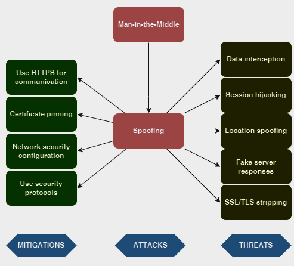
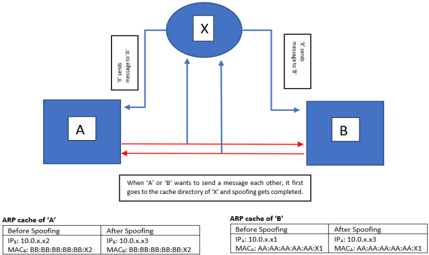
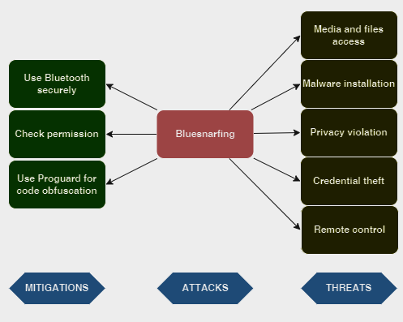

# Communication vulnerabilities

As communication plays a pivotal role in Android apps, vulnerabilities in this aspect pose significant risks to user privacy and data integrity. These vulnerabilities often stem from weaknesses in the transmission and handling of sensitive information between the app and external servers or services. Malicious actors can exploit insecure communication channels, potentially leading to unauthorized access, data interception, or manipulation. 

To address these communication vulnerabilities, developers must prioritize secure transmission protocols, implement robust authentication mechanisms, and regularly update their apps to patch any identified vulnerabilities. Users should also be cautious about sharing sensitive information through apps, particularly on unsecured networks, and stay informed about the security practices of the apps they use. Regular security audits and monitoring can help identify and address potential communication vulnerabilities in Android apps.

## 1. Man-in-the-Middle (MitM) 

Mobile applications usually communicate to remote servers for their operations using the HTTP protocol. This makes it possible for others to interrupt data or the HTTPS protocol, which makes it difficult, if not impractical, to intercept data. The Android platform offers methods and libraries to communicate with the server by the use of these secured network protocols, thus underpinning the Public-Key Infrastructure (PKI). [[1]](https://sci-hub.se/10.1109/ccc.2016.15) 

However, despite the existence of security protocols, the inappropriate use of the Android’s platform secured socket layer libraries might expose the applications to MitM attacks. During MitM attacks, traffic is usually interrupted and a spoofed certification is given to the client to mimic the server. If successful, MitM attacks might convince the customer to reveal their personal login details and other confidential information to the MitM attacker, since the attack permits communication between the server and the client to be interrupted and read unencrypted. MitM attacks are normally executed on controlled Wi-Fi access points. Moreover, during an attack, the network traffic is usually captured for analysis. [[1]](https://sci-hub.se/10.1109/ccc.2016.15)

### Attack tree



### Interception

The initial step intercepts client activity through the attacker's system before it achieves its intended destination. The most well-known (and easiest) method for doing this is an inactive attack in which an attacker makes free/open wifi hotspots accessible to general society. [[2]](https://jurnal.ar-raniry.ac.id/index.php/cyberspace/article/view/3453/2707)

Commonly named in a way that relates to their area, they aren't watchword secured. Once a casualty interfaces with such a hotspot, the attacker gains full permeability to any online information trade. Attackers wishing to adopt a more dynamic strategy to interception may dispatch one of the following attacks:

- IP spoofing involves an attacker disguising himself as an application by altering parcel headers in an ip address. Accordingly, clients attempting to get to a url associated with the application are sent to the attacker's site. [[2]](https://jurnal.ar-raniry.ac.id/index.php/cyberspace/article/view/3453/2707)

- ARP spoofing is the way toward linking an attacker's mac address with the ip address of a legitimate user on a local area network using fake ARP messages. Subsequently, information sent by the client to the host ip deliver is instead transmitted to the attacker. [[2]](https://jurnal.ar-raniry.ac.id/index.php/cyberspace/article/view/3453/2707)

- DNS spoofing, otherwise called DNS store poisoning, involves infiltrating a DNS server and altering a site's address record. Accordingly, clients attempting to get to the site are sent by the adjusted dns record to the attacker's site. [[2]](https://jurnal.ar-raniry.ac.id/index.php/cyberspace/article/view/3453/2707)

### Decryption

After an interception, any two-way SSL movement should be unscrambled without alerting the client or application. Various strategies exist to accomplish this:

- HTTPS spoofing sends an imposter endorsement to the victim's browser once the initial association demand for a safe site is made. It holds an advanced thumbprint related with the bargained application, which the browser confirms according to an existing rundown of confided in destinations. The attacker is then ready to get to any information entered by the casualty before it's passed to the application. [[2]](https://jurnal.ar-raniry.ac.id/index.php/cyberspace/article/view/3453/2707)

- SSL BEAST (browser abuse against SSL/TLS) focuses on a TLS variant 1.0 helplessness in SSL. Here, the casualty's PC is infected with pernicious JavaScript that intercepts scrambled treats sent by a web application. Then the application's figure square chaining (CBC) is endangered in order to decode its treats and authentication tokens. [[2]](https://jurnal.ar-raniry.ac.id/index.php/cyberspace/article/view/3453/2707)

- SSL hijacking happens when an attacker passes produced authentication keys to both the client and application during a TCP handshake. This sets up what seems, by all accounts, to be a safe association when, actually, the man in the middle controls the whole session. [[2]](https://jurnal.ar-raniry.ac.id/index.php/cyberspace/article/view/3453/2707)

- SSL stripping minimizes an HTTPS association with HTTP by intercepting the TLS authentication sent from the application to the client. The attacker sends a decoded form of the application's site to the client while maintaining the anchored session with the application. In the meantime, the client's whole session is noticeable to the attacker. [[2]](https://jurnal.ar-raniry.ac.id/index.php/cyberspace/article/view/3453/2707)

## 1.1. Spoofing

Spoofing is an impersonation technique which is originated from ‘spying’. In the middle century, European spies used to hear secret conversation by impersonating him/her to the communicative party. The same method is applied in modern cryptographic spoofing, as the attacker intercepts a confidential/personal communication between two hosts and controls over transferring data, while the hosts are not being aware of the unauthenticated attacker. [[2]](https://jurnal.ar-raniry.ac.id/index.php/cyberspace/article/view/3453/2707)

When a party wants to communicate with other parties over a cryptographic
network then if their network is same with an unknown MAC address then the server broadcasts an address resolution protocol (also abbreviated as ARP) request to all hosts under the same network connection. The client with the announced Internet Protocol is only expected to make a reply including his/her MAC (Media Access Control) address. [[2]](https://jurnal.ar-raniry.ac.id/index.php/cyberspace/article/view/3453/2707)

However, when ARP cache is managed in a dynamic mode, cache entries can be easily fabricated by forged ARP messages, since proper authentication mechanism is missing. In the meantime, the communicating medium saves the IP to MAC entry in its local cache, so the next time communication can be speeded up, by avoiding the broadcasts. [[2]](https://jurnal.ar-raniry.ac.id/index.php/cyberspace/article/view/3453/2707)

Suppose, we have next network: the attacker X with `IP = 10.0.x.x3, MAC = EE:EE:EE:EE:EE:X3`, victim A with `IP = 10.0.x.x1, MAC = AA:AA:AA:AA:AA:X1`, and victim B with `IP = 10.0.x.x2, MAC = BB:BB:BB:BB:BB:X2`. The next steps for a perfect spoofing based on ARP are shown below:

1. X sends an ARP Reply message to A, which says that `IP: 10.0.x.x3 has MAC address: EE:EE:EE:EE:EE:X3`. This message will update A’s ARP table.

2. X also sends an ARP Reply message to B, which says that `IP: 10.0.x.x2 has MAC address: EE:EE:EE:EE:EE:X3`. This message will update B’s ARP table.

3. When A wants to send a message to B, it will go to X’s `MAC address EE:EE:EE:EE:EE:X3`, instead of ‘B’’s `BB:BB:BB:BB:BB:X2`.

4. When B wants to send a message to A, it will also go to X.



## Mitigations

Mitigating Man-in-the-Middle attacks on Android involves implementing secure communication practices and using appropriate security protocols. Here are some general steps and code snippets that can be considered for enhancing the security of Android apps:

- **Use HTTPS for communication**

    HTTPS protocol is an extended version of the plain HTTP protocol. It adds a security layer to protect data while in transit. HTTPS uses the TLS cryptographic protocol to encrypt communications over a computer network. This mechanism makes use of pairs of related keys (public and private keys) to encrypt/decrypt information using a very strong hashing algorithm. [[3]](https://technocript.com/does-https-prevent-man-in-the-middle/)

    Developers can ensure that app communicates over HTTPS instead of HTTP to encrypt the data in transit:

    ```
    URL url = new URL("https://example.com/api");
    HttpsURLConnection urlConnection = (HttpsURLConnection) url.openConnection();
    ```

- **Certificate pinning**

    An essential part of mobile man-in-the-middle attack prevention is user education. Especially telling users that regardless of how urgently they need to access Wi-Fi, they should be wary of any requests to install a profile or certificate on their device. However, even with security awareness training, users continue to fall victim to phishing schemes and the like. [[4]](https://www.nowsecure.com/blog/2017/06/15/certificate-pinning-for-android-and-ios-mobile-man-in-the-middle-attack-prevention/)

    Beyond user education, mobile app developers can also help protect users against mobile man-in-the-middle attacks on Android OS by implementing certificate pinning in their apps. Certificate pinning was originally created to protect against the threat of a rogue CA. [[4]](https://www.nowsecure.com/blog/2017/06/15/certificate-pinning-for-android-and-ios-mobile-man-in-the-middle-attack-prevention/)

    Here's example code for implementing certificate pinning:

    ```
    HttpsURLConnection urlConnection = (HttpsURLConnection) url.openConnection();
    CertificatePinner certificatePinner = new CertificatePinner.Builder()
        .add("example.com", "sha256/...")  // Add the actual hash of your certificate
        .build();
    urlConnection.setSSLSocketFactory(certificatePinner.sslSocketFactory());
    ```

- **Network security configuration**

    The Network security configuration feature allows developers to configure network security settings with an XML file instead of the application code. [[5]](https://nimblehq.co/blog/popular-methods-to-enhance-your-android-application-security)

    First, developer need to set up the configuration file and add the SSL certificate fingerprints, along with domain information:

    ```
    <?xml version="1.0" encoding="utf-8"?>
    <network-security-config>
      <domain-config cleartextTrafficPermitted="false">
      <domain includeSubdomains="true">yourdomain.com</domain>
          <pin-set>
              <pin digest="SHA-256">9hdyeJFIEmx2Y01oXXXXXXXXXXmmSFZhBXXXXXXXXXX=</pin>
              <pin digest="SHA-256">9Pacxtmctlq2Y73orFOOXXXXXXXXXXZhBXXXXXXXXXX=</pin>
          </pin-set>
      </domain-config>
    </network-security-config>
    ```

    Then, he defines the `android:networkSecurityConfig` attribute in the `<application>` tag referring to the previously created configuration file:

    ```
    <manifest xmlns:android="http://schemas.android.com/apk/res/android"
      package= "com.packagename.id">
      <application android:networkSecurityConfig="@xml/network_security_config">
          …
      </application>
    </manifest>
    ```

- **Use security protocols**

    Secure communication is essential for protecting data integrity and confidentiality. Transport Layer Security (TLS) is a widely adopted protocol for achieving secure communication over a network. 

    ```
    SSLContext sslContext = SSLContext.getInstance("TLSv1.2");
    HttpsURLConnection.setDefaultSSLSocketFactory(sslContext.getSocketFactory());
    ```

    In the example above, `SSLContext` is used to set up the TLS protocol, and `HttpsURLConnection.setDefaultSSLSocketFactory()` is then used to set the SSL socket factory for HTTPS connections. This ensures that the app's communication is secured using TLS.

## 2. Bluesnarfing

Bluesnarfing is a hacking technique in which a hacker accesses a wireless device through a Bluetooth connection. It happens without the device user's permission and often results in the theft of information or some other kind of damage to the device (and user). [[6]](https://www.techtarget.com/searchmobilecomputing/definition/bluesnarfing)

Bluetooth is a high-speed wireless technology for exchanging data between different devices over a short distance. Most Bluetooth-enabled devices have a maximum connectivity range of about 30 feet. The range reduces further when obstacles (such as walls) are present between the devices.

Bluetooth-connected devices are generally safe from hacking because Bluetooth waves are constantly switching frequencies, sometimes hundreds of times per second. This phenomenon is known as frequency-hopping spread spectrum (FHSS). That said, Bluetooth is not completely hacker-safe and Bluetooth-enabled devices are vulnerable to many kinds of attacks, including bluesnarfing. [[6]](https://www.techtarget.com/searchmobilecomputing/definition/bluesnarfing)

### Attack tree



### How a bluesnarfing attack works?

Hackers can initiate bluesnarfing attacks by exploiting vulnerabilities within the object exchange (OBEX) protocol. OBEX's initial purpose was to make it easier to exchange contact information by connecting two phones, allowing devices to form a connection without authentication. In other words, bluesnarfing targets security flaws within the technology used to share files between Bluetooth devices. Bluetooth testing tools like Bluediving identify these vulnerabilities and pinpoint OBEX flaws in Bluetooth-compatible devices. [[7]](https://us.norton.com/blog/mobile/bluesnarfing)

The hacker will usually need to be within 30 feet of Android device to carry out a bluesnarf attack. He scan for any nearby Bluetooth-enabled devices and attempt to pair with them. If the attacker is using specialized equipment, they may reach the device from further away. This is often referred to as a “bluesniping” attack. [[7]](https://us.norton.com/blog/mobile/bluesnarfing)

### The potential impact of bluesnarfing attacks

The main purpose of bluesnarfing is to covertly retrieve information from the target device. Hackers often sell this information to other criminals, usually on the dark web. In some cases, they may use cyberextortion, demanding a ransom from the victim in exchange for returning the information. [[6]](https://www.techtarget.com/searchmobilecomputing/definition/bluesnarfing)

In addition to stealing the victim's data, some skilled hackers may also hijack a device to access its messaging and calling capabilities. The device might then be used to make intimidating calls such as bomb threats, or to conceal their identity while committing other crimes. [[6]](https://www.techtarget.com/searchmobilecomputing/definition/bluesnarfing)

Bluesnarfing attacks may also be used to do the following:

- Download data from the compromised device to their own device (thus creating an exact copy of the device).

- Install malware on the device.

- Use the sensitive data to defraud other victims (e.g., by posing as the first victim).

- Commit identity theft.

- Damage the victim's reputation by making their private information public.

## Mitigations

- **Use Bluetooth securely**

    To use Bluetooth securely, it's essential to establish a secure communication channel between Bluetooth devices. One way to achieve this is by using Bluetooth Secure Simple Pairing (SSP) or Bluetooth Low Energy (BLE) pairing methods. 

    ```
    BluetoothDevice device = ...;
    BluetoothSocket socket = device.createRfcommSocketToServiceRecord(MY_UUID_SECURE);
    socket.connect();
    ```

    This is an example of how to securely establish a bluetooth connection between devices using `BluetoothSocket`, which includes security features to protect against vulnerabilities such as bluesnarfing. [[8]](https://developer.android.com/reference/android/bluetooth/BluetoothSocket)

- **Check permissions**

    To use Bluetooth features in app, developer must declare several permissions. He should also specify whether the app requires support for Bluetooth classic or Bluetooth Low Energy (BLE). If app doesn't require Bluetooth classic or BLE but can still benefit from these technologies, he can check for availability at runtime. [[9]](https://developer.android.com/develop/connectivity/bluetooth/bt-permissions)

    The `BLUETOOTH_ADVERTISE`, `BLUETOOTH_CONNECT`, and `BLUETOOTH_SCAN` permissions are runtime permissions. Therefore, developer must explicitly request user approval in app before he can look for Bluetooth devices, make a device discoverable to other devices, or communicate with already-paired Bluetooth devices. When the app requests at least one of these permissions, the system prompts the user to allow the app to access Nearby devices. [[9]](https://developer.android.com/develop/connectivity/bluetooth/bt-permissions)

    The following code snippet demonstrates how to declare Bluetooth-related permissions:

    ```
    <manifest>
    <!-- Request legacy Bluetooth permissions on older devices. -->
    <uses-permission android:name="android.permission.BLUETOOTH"
                     android:maxSdkVersion="30" />
    <uses-permission android:name="android.permission.BLUETOOTH_ADMIN"
                     android:maxSdkVersion="30" />

    <!-- Needed only if your app looks for Bluetooth devices.
         If your app doesn't use Bluetooth scan results to derive physical
         location information, you can
         <a href="#assert-never-for-location">strongly assert that your app
         doesn't derive physical location</a>. -->
    <uses-permission android:name="android.permission.BLUETOOTH_SCAN" />

    <!-- Needed only if your app makes the device discoverable to Bluetooth
         devices. -->
    <uses-permission android:name="android.permission.BLUETOOTH_ADVERTISE" />

    <!-- Needed only if your app communicates with already-paired Bluetooth
         devices. -->
    <uses-permission android:name="android.permission.BLUETOOTH_CONNECT" />

    <!-- Needed only if your app uses Bluetooth scan results to derive physical location. -->
    <uses-permission android:name="android.permission.ACCESS_FINE_LOCATION" />
    ...
    </manifest>
    ```

- **Use Proguard for code obfuscation**

    Proguard is a code shrinker, optimizer, and obfuscator for Java bytecode. It is often used in Android development to reduce the size of the APK (Android Package) file and to rename classes, methods, and fields in the code to less human-readable forms. This makes reverse engineering more difficult as obfuscated variables and functions won't have easily understandable names. It also improves runtime performance. [[10]](https://developer.android.com/build/shrink-code)

    ```
    # Keep Bluetooth-related classes and methods
    -keep class android.bluetooth.** {*;}

    # Keep UUID constants unobfuscated
    -keepclassmembers class * {
        public static final java.util.UUID MY_UUID = ...;
    }

    # Keep certain attributes to support Bluetooth
    -keepattributes Signature,RuntimeVisibleAnnotations,AnnotationDefault
    ```  

    Analyzing obfuscated code requires additional effort and time. Proguard complicates the reverse engineering process, reducing the likelihood that an attacker understands and exploits the application's functionalities.

## References

[1] [Android Forensics: Investigating Social Networking Cybercrimes against Man-in-theMiddle Attacks](https://sci-hub.se/10.1109/ccc.2016.15)

[2] [Man-in-the-Middle-attack: Understanding in simple words](https://jurnal.ar-raniry.ac.id/index.php/cyberspace/article/view/3453/2707)

[3] [Does HTTPS Prevent Man In The Middle?](https://technocript.com/does-https-prevent-man-in-the-middle/)

[4] [Certificate pinning for Android and iOS: Mobile man-in-the-middle attack prevention](https://www.nowsecure.com/blog/2017/06/15/certificate-pinning-for-android-and-ios-mobile-man-in-the-middle-attack-prevention/)

[5] [Popular Methods To Enhance Your Android Application Security](https://nimblehq.co/blog/popular-methods-to-enhance-your-android-application-security)

[6] [Bluesnarfing](https://www.techtarget.com/searchmobilecomputing/definition/bluesnarfing)

[7] [Bluesnarfing: An overview + prevention tips](https://us.norton.com/blog/mobile/bluesnarfing)

[8] [BluetoothSocket](https://developer.android.com/reference/android/bluetooth/BluetoothSocket)

[9] [Bluetooth permissions](https://developer.android.com/develop/connectivity/bluetooth/bt-permissions)

[10] [Shrink, obfuscate, and optimize your app](https://developer.android.com/build/shrink-code)
