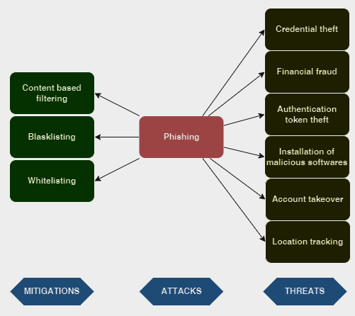
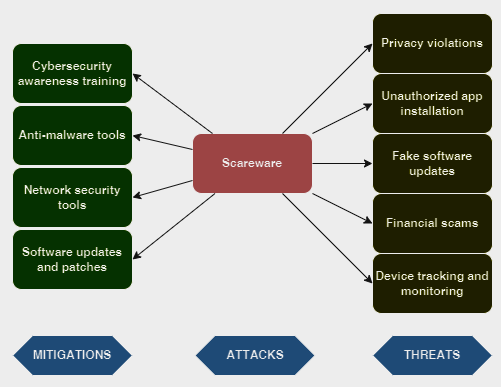

# Social engineering attacks

Social engineering refers to a wide range of malicious activities attained through human interactions. It leverages psychological manipulation to trick people into committing security mistakes and providing sensitive information. The kind of information cyber criminals are seeking can vary. But when they target an individual by tricking them into providing them their bank information or password or access their mobile to install malicious software. It will give them access to victim's device and control over their mobile phone.

## 1. Phishing 

Phishing is a type of online identity theft in which sensitive information is obtained by misleading people to access a malicious webpage. Human behavior is strongly associated with technology, and phishing is solely based on social engineering, which relies on exploiting human vulnerability in order to trick the victim into providing sensitive credentials. Thus, phishing is one of the forms that social engineering can take. [[1]](https://sci-hub.se/10.1109/innovations.2014.6987555)

One of the main methods that mobile phishing has been applied is through developing a malicious application that is a copycat of a legitimate one.
In addition, there is a factor that further contributes to these threats, which is the ability to download applications from unknown resources. Many users download non-market applications carelessly with little or no knowledge about the developers. [[1]](https://sci-hub.se/10.1109/innovations.2014.6987555)

Phishers are motivated to target mobile devices due to several different reasons. One of which is the mobiles’ display constraints that could be used to hide the URL bar.
Also, due to these constraints, mobile browsers do not show bookmarks bar when displaying webpage screen. It is often difficult for the users to distinguish between fake and real user interfaces (UI), and since they cannot see the bookmarks bar and the URL, they might fall into the pit of fake UIs. Moreover, mobile users become familiar with entering their sensitive information in repeated mobile settings. [[1]](https://sci-hub.se/10.1109/innovations.2014.6987555)

### Attack tree

### Android phishing attack techniques

**Small screen and partial display of URLs**

Mobile devices and smart phones mostly have a small screen. Those small screens make it harder to see the full URLs when users click to the links. Also, the companies keep their mobile web sites simple to be able to use the small screen more efficiently. Moreover, some of them cannot even put their own logo due to limited screen size. Therefore, many users are not aware when they are not at official web sites while browsing on the Internet. [[2]](https://www.scirp.org/html/5-7800290_57634.htm)

When a fake site URL and a legitimate site URL are compared, the differences in URL can be hidden due to small size of the screen and URL bar. While legitimate address has secure protocol, HTTPS, the fake site does not. In addition, the fake page has some additional text which may not be visible at all to users at some browsers. Besides the URL address, the fake-site does not display the original app logo. In addition, they pull the attention to the other images to trick the users. [[2]](https://www.scirp.org/html/5-7800290_57634.htm)

**Smishing**

Another popular phishing method is using SMS messages; this method is called “smishing”. It works the same way as phishing, but instead of an email, a victim receives a text message that asks for banking credentials or to claim a prize. Once the user receives the smishing message from a phone number, it is recommended to inform the cell phone carrier. [[2]](https://www.scirp.org/html/5-7800290_57634.htm)

**Wi-Fi and Vishing**

Wi-Fi phishing occurs when a user connects to the Internet via Wi-Fi hotspots. Evil twin is an example where attackers set up a Wi-Fi to eavesdrop on wireless communications where there is a legitimate Wi-Fi hotspot.

Vishing, voice mail phishing, is a phishing attack on mobile devices into Bluetooth phishing or Voice over IP phishing to reach users’ identification or financial information. Other vishing schemes may play a message about a local or regional bank in the area by recording the greeting message of a real bank. Scammers attempt to greet victims and lure them into providing credentials for online banking. [[2]](https://www.scirp.org/html/5-7800290_57634.htm)

## Mitigations

Although it is hard to detect fake mobile applications, there are several methods to reduce phishing attacks on mobile devices. Common phishing detection systems for mobile devices include content-based filtering, blacklisting, and whitelisting.

- **Content based filtering**

    In this technique, content is examined for suspected URLs and matches the context of the URLs. The approach supplements traditional spam filtering techniques. Content-Based filtering can be performed based on a set of rules or based on identifying statistical differences between benign and suspected phishing contents. It can effectively detect smishing, vishing, and Wi-Fi phishing attacks. [[2]](https://www.scirp.org/html/5-7800290_57634.htm)

- **Blacklisting**

    In this approach, based on human verification, a set of websites is explicitly listed as known phishing URLs. This approach leads to very low false positive rates and is currently supported by various browsers that communicate with trusted servers to obtain a list of blacklisted URLs. Though this approach can possibly identify suspected websites, it may not be able to detect smishing, vishing, and Wi-Fi phishing attacks. [[2]](https://www.scirp.org/html/5-7800290_57634.htm)

- **Whitelisting**

    In this method, users specify websites they trust and access frequently so that other websites are examined for suspected phishing attacks. The approach can be applied to detect smishing where a set of legitimate numbers can be provided to stop receiving unwanted SMS containing fake web addresses. [[2]](https://www.scirp.org/html/5-7800290_57634.htm)

## 2. Scareware 

Scareware attack involves the target being bombarded with fake alarms and false threats. Victims are deceived that their device is infected with malware that prompts them to install software with no real benefits. Scareware is referred to as deception software, fraudware, or rogue scanner software. [[3]](https://medium.com/@SecIron/mobile-app-security-knowledge-base-social-engineering-attack-197f7e8b3677)

A common example of scareware is the popup banners that look legitimate while surfing the web. These pop ups display texts saying, “Your device may be infected with malicious programs.” It either directs you to a malicious site or installs an infected tool that can cause damage to your device. Scareware can be distributed through spam emails making offers to buy harmful services appearing legitimate. [[3]](https://medium.com/@SecIron/mobile-app-security-knowledge-base-social-engineering-attack-197f7e8b3677)

### Attack tree

### How does scareware work?

Scareware pop-ups may use the logos of real companies, like Google, to seem legitimate. Scammers may also use URLs and product names that seem legitimate. Some scammers disguise their pop-ups as notifications from the device’s operating system, flashing warnings like “Android has detected a problem!” Other scammers make their messages look like reports from a real antivirus program — e.g., “A recent scan found five viruses on your device.” [[4]](https://www.ibm.com/topics/scareware)

After scaring victims, scareware messages offer a “solution” to their “problem.” Usually, scammers instruct victims to download fake security software or pay a fee. If users comply, a few things can happen:

- The user follows the message to a scam website, where they enter their credit card information to buy the software. There is no software, and scammers steal the victim's data to commit identity theft.

- Instead of stealing data, some scammers charge users for software that doesn’t do anything (except maybe slow their device down).

- In the worst case, scareware programs are trojan horses carrying malicious software, like spyware that secretly collects personal data.

Even if a victim doesn’t follow the scammers’ instructions, scareware can get onto their device. Some hackers design their pop-up windows so that clicking the “close” button starts a covert drive-by download. [[4]](https://www.ibm.com/topics/scareware)

### Examples of scareware

**Fake virus scams** 

The classic scareware pretext uses pop-up messages to warn users their devices are infected with malware. These pop-ups may look like real scan reports from antivirus software. Scammers then direct users to download fake security software that steals their money or installs malware. For example, the scammers behind the fake antivirus program SpySheriff coerced users into paying to remove non-existent malware. [[4]](https://www.ibm.com/topics/scareware)

**Fake tech support**

These scams usually start with a pop-up that instructs the victim to call a phone number for help, but some scammers may cold call their victims. Once the scammer has someone on the phone, they convince the user to uninstall real security software and grant the scammer remote access to their device. From there, the scammer steals the victim’s data or installs malware. [[4]](https://www.ibm.com/topics/scareware)

**Malvertising**

Malvertising is a cyberattack in which hackers hijack legitimate ads — or legitimate ad space, like on Facebook or in Google search results — to spread viruses. In the case of scareware, a user might see an ad on a webpage that offers free antivirus software. Because it’s an ad rather than a sketchy pop-up, users might be more likely to click it. [[4]](https://www.ibm.com/topics/scareware)

**Law enforcement scams**

Attackers pretend to be the police or the security agency. A pop-up warns the victim that “illegal material” was found on their device. If the victim pays a fine, the “problem” will go away. For extra pressure, these pop-ups may lock the screen until the victim pays. [[4]](https://www.ibm.com/topics/scareware)

## Mitigations

Once scareware infects a device, removing it can be difficult. Scareware programs can disable other security software and hide program files, making them harder to detect. Some fake antivirus software has been known the reinstall itself after removal.

To prevent scareware from taking root, organizations and users might consider the following tools and practices:

- **Cybersecurity awareness training**

    Like other social engineering tactics, scareware is less effective against users who know the telltale signs of an attack — such as the difference between real antivirus notifications and scam pop-up ads. [[4]](https://www.ibm.com/topics/scareware)

- **Anti-malware tools**

    Legitimate anti-malware and antivirus software can block users from installing scareware programs. They can also help remove scareware that makes it onto the device. Because some scams convince users to disable antivirus software, security teams may limit users’ permissions for these tools. [[4]](https://www.ibm.com/topics/scareware)

- **Network security tools**

    Firewalls can prevent malicious traffic from reaching users’ web browsers, and URL filters can keep users from visiting scam websites. Ad blockers, pop-up blockers, and spam filters can also stop scareware messages from appearing. [[4]](https://www.ibm.com/topics/scareware)

- **Software updates and patches**

    As with most cyberthreats, scareware programs exploit system vulnerabilities to infect devices. Keeping security tools, web browsers, and other apps updated can help thwart tactics like malvertising and drive-by downloads. [[4]](https://www.ibm.com/topics/scareware)

## References

[1] [Mobile Phishing Attack for Android Platform](https://sci-hub.se/10.1109/innovations.2014.6987555)

[2] [Mobile Phishing Attacks and Mitigation Techniques](https://www.scirp.org/html/5-7800290_57634.htm)

[3] [Mobile App Security Knowledge Base: Social Engineering Attack](https://medium.com/@SecIron/mobile-app-security-knowledge-base-social-engineering-attack-197f7e8b3677)

[4] [What is scareware?](https://www.ibm.com/topics/scareware)
