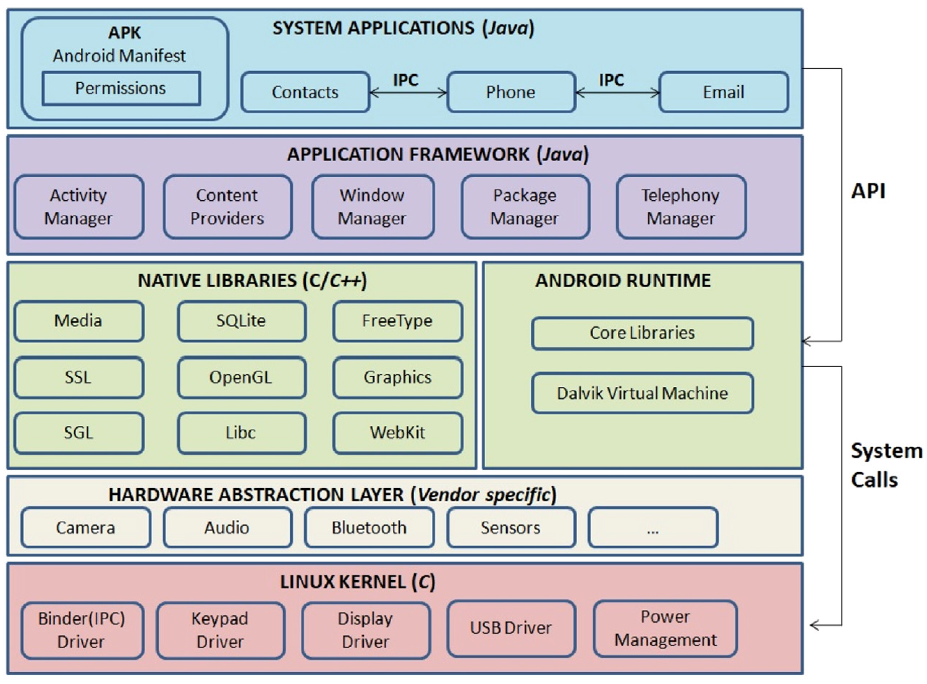
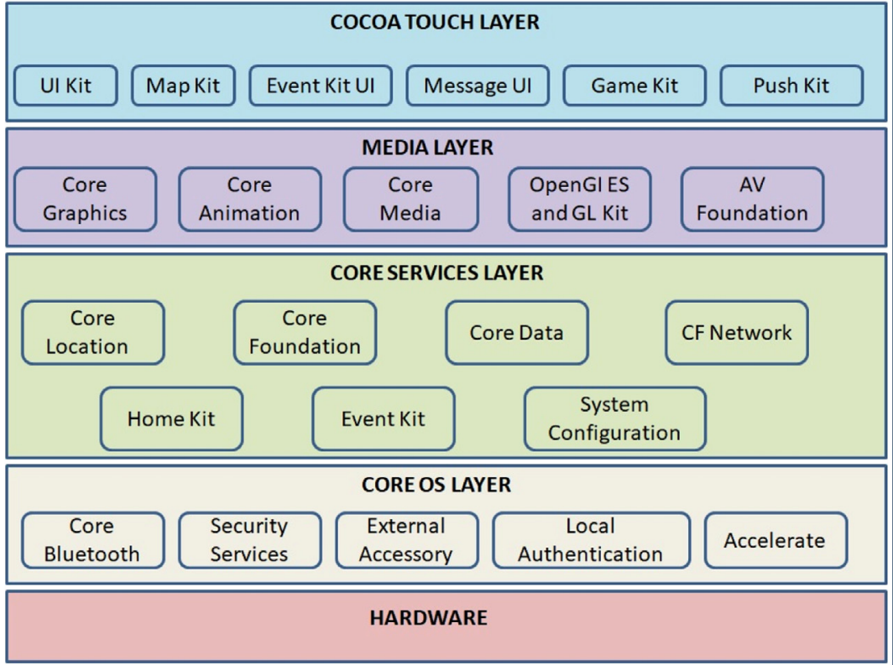

# Architecture
Comparison of system architectures and different layers

## Android

Kernel - Linux  
Language - Dalvik (Java)  
Source model - Open Source

### Layers:  

*   **Kernel**      
        The Android kernel is based on an upstream Linux Long Term Supported (LTS) kernel. LTS kernels are combined with Android-specific patches to form Android Common Kernels (ACKs). Newer ACKs are also known as GKI kernels. GKI kernels support the separation of the hardware-agnostic generic core kernel code and GKI modules from the hardware-specific vendor modules. The GKI kernel interacts with hardware-specific vendor modules containing system on a chip (SoC) and board-specific code. The interaction between the GKI kernel and vendor modules is enabled by the Kernel Module Interface (KMI) consisting of symbol lists identifying the functions and global data required by vendor modules.

*   **HAL (Hardware Abstraction Layer)**  
        Interface for communicating the Android application/framework with hardware-specific device drivers such as camera, Bluetooth, etc. HAL is hardware-specific and implementation varies from vendor to vendor. In Android 8.0 and higher, the lower-level layers are re-written to adopt a new, more modular architecture. These devices must support HALs written in HIDL (HAL interface definition language), with a few exceptions listed below. These HALs can be binderized or passthrough. In Android 11, HALs written in AIDL (Android Interface Definition Language) are also supported. All AIDL HALs are binderized. In a Binderized HAL, the Android framework and HALs communicate with each other using binder inter-process communication (IPC) calls.

*   **ART (Android Runtime)**  
        Android runtime (ART) is the managed runtime used by applications and some system services on Android. ART and its predecessor Dalvik were originally created specifically for the Android project. ART as the runtime executes the Dalvik Executable format and Dex bytecode specification. During app installation, it uses ahead-of-time (AOT) and just-intime (JIT) compilation, which compiles the Dalvik bytecode into native binaries (ELF format). This optimizes garbage collection and power assumption and achieves high runtime performance.

*   **Native Libraries**  
        Core system services and different components of Android like ART and HAL are built from the native libraries, which are written in C/C++. These libraries interact directly with the kernel or other interfaces and don't depend on a userspace-based HAL implementation and provide support in building user interface application framework, drawing graphics and accessing database.

*   **Application framework**  
        Android SDK provides tool and API libraries to develop applications on Android java. Important features are database for storing data, support for audio, video and image formats, debugging tools, etc. 
        The Android Activity Manager is responsible for predictable and consistent behavior during application transitions. Applications can listen to events such as device rotation, app destruction due to memory shortage, an app being shifted out of focus, etc. 
        Android has a standardized way to share data between applications on the device using the Content Provider. Developers can use the content provider to expose data to other applications. 
        The Android Window Manager is a system component that oversees the creation, positioning, and management of windows on the device's screen, providing crucial information to applications for adapting their user interfaces and facilitating a cohesive and immersive user experience.
        Android also provides access to information about installed applications using Package Manager. Android keeps track of application information such as installation and uninstallation events, permissions the app requests, and resource utilization such as memory consumption.
        Android uses Telephony Manager to combine hardware and software components to deliver telephony features. The hardware components include external parts such as the sim card, and device parts such as the microphone, camera, and speakers.

*   **System applications**  
        Applications are located at the top most layer of the Android stack. These consist of both native and third-party applications such as web browser, email, SMS messenger, etc., which are installed by the user. System apps are pre-installed apps in the system partition with the ROM. In other words, a system app is simply an app placed under /system/app folder on an Android device. /system/app is a read-only folder. Android device users do not have access to this partition and they cannot directly install or uninstall apps to/from it. Apps such as camera, settings, messages, Google Play Store, etc. come pre-installed with the phone and manufacturers do not generally provide an option to remove such apps as this might impact the functioning of device.

## iOS

Kernel - OS X, UNIX  
Language -  Objective C  
Source model -  Closed, but iOS components are open source

### Layers:  

*   **Hardware**      
        The iOS hardware layer consists of the physical components within Apple devices, including custom-designed processors, memory, storage, displays, cameras, sensors, and connectivity features. These components work in unity to support the iOS operating system and deliver a high-performance and integrated user experience. This layer contains the physical chips, which are soldered to the iOS circuitry.

*   **Core OS**  
        The Core OS layer is the last layer of the iOS stack and sits directly on top of the device hardware. System components of the Core OS Layer provides much of the same functionality as any other UNIX like operating system. This layer includes the operating system kernel and the kernel is the foundation on which the entire iOS platform is built and provides the low level interface to the underlying hardware. Amongst other things, the kernel is responsible for low level networking, input/output, inter-process communication, access to external accessories and the usual fundamental operating system services such as memory management (allocation and de-allocation once the application has finished using it), file system handling and threads, network management, etc. 

*   **Core services**  
        This forms the foundation layer on which above layers are built. It provides several features like data protection, iCloud storage, file sharing support, XML Support features, SQLite database, In-App purchases, etc.
        The CFNetwork framework provides a C-based interface to the TCP/IP networking protocol stack and low level access to BSD sockets. This enables application code to be written that works with HTTP, FTP and Domain Name servers and to establish secure and encrypted connections using Secure Sockets Layer (SSL) or Transport Layer Security (TLS).
        The Core Data framework is provided to ease the creation of data modeling and storage in Model-View-Controller (MVC) based applications.
        The Core Foundation is a C-based Framework that provides basic functionality such as data types, string manipulation, raw block data management, URL manipulation, threads and run loops, date and times, basic XML manipulation and port and socket communication.
        The Core Location framework allows user to obtain the current geographical location of the device (latitude and longitude) and compass readings.
        The EventKit framework is an API designed to provide applications with access to the calendar and alarms on the device.
        The System Configuration framework allows applications to access the network configuration settings of the device to establish information about the “reachability” of the device.

*   **Media**  
        This layer is responsible for graphics, audio and video capabilities. Media layer consists of three different frameworks — Graphic framework, Audio framework and Video framework. These frameworks help in accessing photos and videos stored on the device, to manipulate the images through filters and provide support for 2D drawings.

*   **Cocoa touch**  
        It provides key frameworks for building iOS apps and defines their appearance. This layer is responsible for fundamental technologies like multitasking, touch-based input, push notifications, and many high-level system services. Cocoa Touch is primarily written in Objective C language and is based on Mac OS X. It was developed based on model view controller software architecture. The high-level application programming interfaces available in Cocoa Touch help to make animation, networking, and adding the appearance and behavior of the native platform to the developed applications possible with less code development.