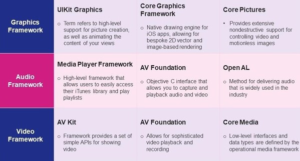

# Secure iOS App Development - Media Layer

Assuming an iOS developer is creating a mobile application where the goal is audio or visual data processing, the main focus of security analysis will be on media layer of iOS architecture.

This analysis will contain threats, attacks, and adequate mitigation strategies or standard security protocols developers are meant to follow. It is crucial not only for delivering a seamless user experience but also for safeguarding the confidentiality, ensuring integrity, and availability of the implemented features.

It is every organization's/developer's responsibility to make sure that the code, logic, data, and its communication is secured in the right way to prevent from any intruders tampering and understanding the code. [[1]](#resources)

This security analysis consists of three parts:
1. [Media input vulnerabilities analysis](media-input-vulnerabilities.md)
2. [Media access vulnerabilities analysis](media-access-vulnerabilities.md)
2. [Microphone/Camera access vulnerabilities analysis](unauthorized-access-to-mic-cam.md)

## Resources 
1. [iOS Mobile App Security — Part I: Best practices for iOS mobile developers](https://medium.com/@kavithakumarasamy89/ios-mobile-app-security-part-i-best-practices-for-ios-mobile-developers-1220748b1f3)