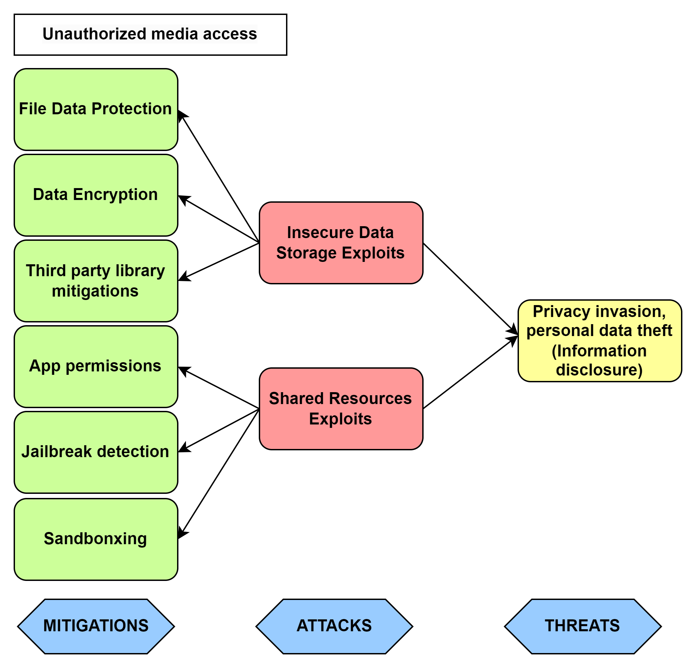
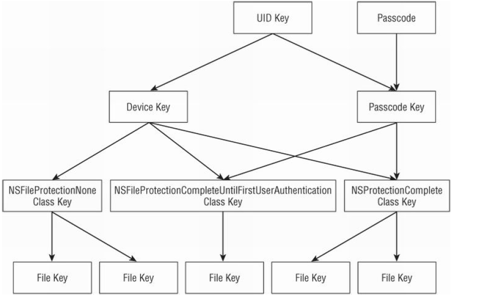

# Media access vulnerabilities

Since the field of attack for malicious or unauthorized access to media is large, this section will be focused mainly on preservation of integrity of data in rest.

## **Attack tree**

Following photo shows terms that will further be described in this section. It represents covered attacks, identified threats that could be exploited, and proposed strategies and countermeasures to mitigate those attacks.

**Media Files Directories**

- *Bundle Resources* - 
    When you include media files in your Xcode project, they are often added to the app's bundle. These files are read-only and can be accessed using the *NSBundle* class.[[2]](#resources)

- *Documents Directory* -
    User-created data that should be visible to the user. Backed up, but user can disable backup for specific apps
    This directory is writable, and you can use the *NSFileManager* class to manage files in this location.[[2]](#resources)

- *Caches Directory* -
    Semi-persistent cached files, not visible to the user and not backed up, is suitable for storing temporary files that can be regenerated. Use *NSFileManager* to manage files in the Caches directory.[[2]](#resources)
    
- *App Sandbox* -
    Persistent files necessary to run the app, not visible to the user. Backed up, but user can disable backup for specific apps.[[2]](#resources)
    iOS apps run in a sandboxed environment, meaning they have limited access to the device's file system. Each app has its own container, and one app cannot access the data of another app. 
    
**Frameworks Accessing Media Files**

- *UIKit Framework* - The UIKit framework provides classes like *UIImage* and *UIImageView* for working with images, and *UIImagePickerController* for accessing the device's camera or photo library. [[6]](#resources)

- *AVFoundation Framework* - For working with audio and video, the *AVFoundation framework* is commonly used. It provides classes like *AVPlayer* and *AVAsset* for playback and manipulation of audio and video content. [[6]](#resources)

## Threats

- ***Privacy Invasion And Data Theft as Information Disclosure***
    
    Risks of unauthorize resources access can be very compromising in therms of user privacy. One primary concern is the invasion of privacy, as unauthorized individuals or entities gain access to sensitive information, violating the confidentiality of personal data. This breach can lead to reputation damage for individuals and organizations alike, eroding trust and credibility in the eyes of users and stakeholders. Moreover, the potential for data theft increases, exposing sensitive details that can be exploited for malicious purposes, such as identity theft or financial fraud. 

## 1. Insecure Data Storage exploits

If sensitive media files are stored in an insecure manner, for example without strong encryption, attackers may gain 
unauthorized access by directly accessing the file system. Without proper protection mechanisms application could easily leave media files susceptible to leaks and theft. 

Developers should ensure that access to these resources follows a secure policy (such as encrypting data before sending to the server). It is advisable to also make sure that there aren't 3rd party libraries in use that access resources insecurely. [[1]](#resources)

### Mitigations

- ***File Data Protection***

    When a new file is to be saved, a developer can choose from these options to better use of data protection:

    - Complete Protection (*NSFileProtectionComplete*) [[2]](#resources)
        - Only readable if device is unlocked.
        - File is closed when the device is locked.
        - Suitable for most apps and data.
    
    - Protected Unless Open (*NSFileProtectionCompleteUnlessOpen*) [[2]](#resources)
        - File can only be opened when the device is unlocked.
        - File is not closed when the device is locked.
        - File is encrypted when the last open handle is closed.
        - Suitable for data that is uploaded in the background

    - Protected Until First User Authentication (*NSFileProtectionCompleteUntilFirstUserAuthentication*) - default  [[2]](#resources)
        - File is inaccessible until the device is unlocked once after boot.
        - Suitable for background processes that should start ASAP after boot.
        - In general, all user data should be at least at this level.

    - No Protection (*NSFileProtectionNone*)  [[2]](#resources)
        - Suitable for certain applications that must access data immediately on boot without any user interaction. This encryption/decryption is handled by the OS and the keychain transparently. The relevant decryption key is created from the keychain when appropriate and erased from memory when appropriate

    Choosing the easiest or more prone to vulnerable options like, *NSFileProtectionNone* may lead to potential security risk.
    It is advisable to use *NSFileProtectionCompleteUnlessOpen* and *NSFileProtectionCompleteUntilFirstUserAuthentication* to have data protection on all files. [[1]](#resources)

    **Example:**

    Encrypting a file on the first write

    <pre>do {
    try data.write(to: fileURL, options: .completeFileProtection)
    }
    catch {
    // Handle errors.
    }</pre>

    Encrypting an existing file on disk
    <pre>do {
    try (fileURL as NSURL).setResourceValue( 
                    URLFileProtection.complete,
                    forKey: .fileProtectionKey)
    }
    catch {
    // Handle errors.
    }</pre>
    

- ***Data Encryption***

    Storing sensitive data locally on a user's device should be done securely to prevent unauthorized access. Apple provides several tools and mechanisms to ensure the safe storage of data, such as Keychain Services and Data Protection APIs.[[5]](#resources)

    - Keychain - iOS provide the system and applications with a secure key-value store API called the Keychain for storing sensitive secrets such as keys and passwords. The Keychain provides encrypted storage and permission access to the secret items.[[4]](#resources)
    
        Since it doesn't handle media files, for data encryption is advisable to use Data Protection APIs.

    - Data Protection API allows you to encrypt files stored on the device, making them inaccessible when the device is locked.  [[5]](#resources)

        Code example:
        <pre>
        let fileURL = documentsDirectoryURL.appendingPathComponent("sensitive_data.txt")

        do {
            let data = "Sensitive data to be stored securely.".data(using: .utf8)
            try data?.write(to: fileURL, options: .completeFileProtection)
        } catch {
            print("Error writing data to file: \(error.localizedDescription)")
        }
        </pre>

    The Data Protection API was designed to make it as simple as possible for application developers to sufficiently protect sensitive user data stored in files and keychain items in case the user's device is lost. 

    All the developer has to do is indicate which files or items in the keychain may contain sensitive data and when that data must be accessible. 

    For example, the developer may indicate that certain files or keychain items contain sensitive data that needs to be accessible only when the device is unlocked. This is a common scenario, because the device must be unlocked for the user to interact with the application. Alternatively, the developer may indicate that certain files or keychain items must always be accessible and thus cannot be protected when the device is locked. In the application source code, the developer marks protected files and keychain items using constants that define their protection class. The various protection classes are differentiated by whether they protect files or keychain items and when the data protected by that protection class is to be made available (always or only when the device is unlocked, for example). The different protection classes are implemented through a key hierarchy where each key is derived from a number of other keys or data. 

    

    At the root of the key hierarchy are the UID key and the user's passcode. 
    The UID key is a key that is unique to each individual iOS device and embedded into the onboard cryptographic accelerator. The actual key itself is not accessible through software, but the accelerator can use this key to encrypt or decrypt specified data. When the device is unlocked, the user's passcode is encrypted many times using a modified PBKDF2 algorithm to generate the passcode key. This passcode key is preserved in memory until the device is locked. The UID key is also used to encrypt a static byte string in order to generate the device key. The device key is used to encrypt all of the class keys that represent each of the filerelated protection classes. Some class keys are also encrypted using the passcode key, which ensures that the class keys are accessible only when the device is unlocked.[[7]](#resources) 

- [***Third party library mitigations***](media-input-vulnerbilities.md/#mitigations-2)

## 2. Shared Resources Exploits:

If an app shares resources insecurely with other apps or the system, an attacker might exploit these shared resources to access media files (if files are placed in shared directories without appropriate permissions).

In addition to time-of-check–time-of-use problems, many other file operations are insecure. Programmers often make assumptions about the ownership, location, or attributes of a file that might not be true. 

For example, you might assume that you can always write to a file created by your program. 
However, if an attacker can change the permissions or flags on that file after you create it, and if you fail to check the result code after a write operation, you will not detect the fact that the file has been tampered with. [[3]](#resources)

Examples of insecure file operations include:
- writing to or reading from a file in a location writable by another user -> data leaks through Shared Resources
- failing to make the right checks for file type, device ID, links, and other settings before using a file
- failing to check the result code after a file operation
- assuming that if a file has a local pathname, it has to be a local file

### Mitigation

- ***App permissions***

    App permission includes additional privacy transparency and control features such as listing privacy-relevant permissions in the AppStore, allowing finer-grained access to photos, an OS supported recording indicator.

    Most of these features are focused on the privacy of users from app developers rather than from the phone itself, the relevant adversary under the threat model of forensics.[[4]](#resources)

- [***Sandboxing***](media-input-vulnerbilities.md/#mitigations-2)
- [***Jailbreak detection***](media-input-vulnerbilities.md/#mitigations-2)

## Resources

1. [iOS Mobile App Security — Part I: Best practices for iOS mobile developers](https://medium.com/@kavithakumarasamy89/ios-mobile-app-security-part-i-best-practices-for-ios-mobile-developers-1220748b1f3)
2. [Secure iOS application development](https://github.com/felixgr/secure-ios-app-dev)
3. [Secure Coding Guide - Types of Security Vulnerabilities](https://developer.apple.com/library/archive/documentation/Security/Conceptual/SecureCodingGuide/Articles/TypesSecVuln.html#//apple_ref/doc/uid/TP40002529-SW14)
4. [Data Security on Mobile Devices: Current State of the Art, Open Problems, and Proposed Solutions](https://arxiv.org/pdf/2105.12613.pdf)
5. [Enhancing Security in iOS Applications: Best Practices and Code Examples](https://medium.com/geekculture/enhancing-security-in-ios-applications-best-practices-and-code-examples-41cda1ff62fa)
6. [Architecture of IOS Operating System](https://www.geeksforgeeks.org/architecture-of-ios-operating-system/)
7. [iOS Hacker's handbook](./resource/ios-hackers-handbook.pdf)
