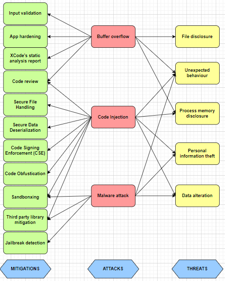

# Media input vulnerbilities

It is impmortant to keep in mind that obvious forms of input, such as strings entered through dialog boxes, are not the only potential source of malicious input. [[2]](#resources)

When a program solicits audio/photo/video input, it inherently exposes itself to the possibility of receiving unwanted data. This vulnerability arises from the dynamic nature of input sources, where the information provided may not always conform to the expected or desired format. Inappropriate data can take various forms, ranging from erroneous or malformed inputs to deliberately malicious content intended to exploit vulnerabilities within the program. 

Therefore developers must be vigilance in anticipating and managing diverse input scenarios to enhance the overall reliability and security of their applications.

## Threats
Input exploits have been used to:
 - file disclosure
 - unexpected behavior
 - process memory disclosure
 - personal information theft
 - data alteration
 - *jail break* [[2]](#resources)

## 1. Buffer overflow attack

Buffer overflows, both on the stack and on the heap, are a major source of security vulnerabilities. For example, the input data might be longer than what you have reserved room for in memory.
Buffer overflows in one operating system's help system could be caused by maliciously prepared embedded images.
A commonly-used media player failed to validate a specific type of audio files, allowing an attacker to execute arbitrary code by causing a buffer overflow with a carefully crafted audio file. [[2]](#resources)

### Mitigations

- ***Input validation***

    As a general rule, it is always advisable to check all input received by program to make sure that the data is reasonable. This process is commonly known as input validation or sanity checking. A graphics file can reasonably contain an image that is 200 by 300 pixels, but cannot reasonably contain an image that is 200 by -1 pixels. However, nothing prevents a file from claiming to contain such an image however.  [[2]](#resources)

- ***App hardening***

    In order to make exploiting iOS applications harder for the attacker, it is recommended to enable platform exploit mitigation compile-time options.

    Flags to enable: 
    Stack smashing protection (<code>-fstack-protector-all</code>). This potentially helps to prevent stack buffer overflows.

    Check with (should be on by default): 
    <code>otool -I -v binary | grep stack_chk_guard</code> 
    [[3]](#resources)

- ***Xcode's static analysis report***

    Static analysis can help to reveal memory leak, use-after-free, use-after-release, and other bugs. 
    Audit tip is to check the output of Xcode's "Build & Analyze" [[3]](#resources)

## 2. Code injection attack

Code Injection is the general term for attack types which consist of injecting malicious code that is then interpreted/executed by the application. This type of attack exploits handling of untrusted data. This type of attack can have severe consequences, allowing attackers to manipulate the behavior of the application, compromise user data, or gain unauthorized access. [[12]](#resources)

Processing a maliciously crafted media files can pose serious security risks, specially if there are vulnerabilities in the image processing software. When attacker craft images with malformed or unexpected headers and metadata, image processing libraries may misinterpret such data, leading to memory corruption or code execution. [[11]](#resources)

Embedding malicious scripts within media files that can be executed during processing also pose for code injection attack.
If the image processing software supports scripting, attackers may inject code that gets executed in the processing context.[[10]](#resources)

### Mitigations 

- ***Secure File Handling***

    Always validate and sanitize user input on the server to ensure that malicious data doesn't reach the application. [[2]](#resources) Implement strict file handling mechanisms and ensure that you validate the file type and content.

    When dealing with media inputs, use safe APIs provided by iOS for handling media files to avoid any vulnerabilities. Avoid using unsafe functions or methods that may expose your app to injection attacks. [[8]](#resources)

- ***Secure Data Deserialize***

    During deserialization, some objects are re-instantiated in memory. Thus, if the serialized data originates from an untrusted source, code execution might be possible.

    When writing your own classes, it is generally a good idea to comply with the *NSSecureCoding* protocol, to make sure that classes constructed from external sources are the intended class. It is also required by Apple for classes that are used with inter-application communication (UIActivityViewController). [[4]](#resources)

- ***Code Signing Enforcement***

    In order to prevent the introduction of new executable code at runtime, iOS implements a security protection called *Code Signing Enforcement* (CSE). This prevents applications from loading unsigned libraries, downloading new code at runtime, and using self-modifying code. It is also a strong protection against remote attacks that inject new native code into the application [[5]](#resources)

- ***Sandboxing***

    iOS enforces restrictions that limit each application's access to user data and the operating system APIs. This mechanism is designed to protect against incursions by malicious third-party applications, and to limit the damage caused by exploitation of a non-malicious application. To implement this, iOS runs each application in a *sandbox* that restricts its access to the device file system and memory space.[[5]](#resources)

- ***Code review***

    For applications distributed via its AppStore (which is the only software installation method allowed on a device with default settings) Apple additionally performs automated and manual code review of third-party applications.
    Despite these protections, maliciousor privacy-violating applications have passed review. [[6]](#resources)

- ***iOS — Code Obfustication***

    Last but not least, anybody can reverse engineer and check for classes and methods in an iOS app, try to dynamically inject code for that method/notification observer. It is advised to obfusticate the code, so the app logic is not compromised at direct runs.

    Use strong code Obfustication libraries 3rd party tools that offer some degree of obfuscation and integrity protection including: *Arxan*, *Metaforic*, *Cryptanium*. These libraries give a tough for reverse obfustication. [[1]](#resources)

## 3. Malware attack

Common malware known to speciffically attack media layer is AdKing or AdLord adware. 

This is a form of malware which can only infect *jailbroken* devices. It uses third-party Cydia library to display advertisements over other apps or in the notification bar and ask users to download the promoted iOS apps. The malware will be functioning whenever the apps are open. The iOS framework involved is the *AVFoundation* framework, located at the Media layer.[[7]](#resources)

### Mitigations

- ***Sandboxing***

- ***Jailbreak detection***

    "Jailbreaking" has been used to permit unsigned iOS code to be executed on an Apple mobile device and to permit service connections to other mobile carriers. Cydia, an unauthorized iOS application installer, has been distributing unapproved applications in competition to the Apple app store. While unsigned code may not be malicious, Apple's signing process does provide some assurance that classic C vulnerabilities have been addressed. [[13]](#resources)

    Application logic and behavior might be compromised on JailBroken devices, and application exposed to attacks. With that said, any hacker can bypass those basic checks with some effort, therefore it is important to know this and not completely rely on the jailbreak detection methods.

    The following tests check and inform the developer that if device is jailbroken:

    - A lot of unique files and applications are installed on a jailbroken device. Checking for these files in the file system can help identify whether the device is jailbroken or not. This test checks that the developer is looking for these files.
    - Check to see whether the application follows sandboxing rules can help the user identify whether the application is jailbroken or not. A good way to check is to see if we can modify a file in some location outside the application bundle. This test looks for such checks by the developer.
    - If calling the Cydia's URL scheme (Cydia://) from your application results in success, it can be sure that the device is jailbroken. This test checks whether the developer performs this check.

    Apart from these, it is advisable to check every possible way to really find if the device is compromised. [[1]](#resources)

- ***Third party library mitigations***
    
    Third-party frameworks are necessary evils. They offer some valuable resources that enhance your iOS app functionalities but most of them are vulnerable and loosely secured. One of the iOS app development best practices is to keep these third-party integrations updated to the latest stable version available at all times. Keep an eye out for ad libraries if you're using any. Don't disable ATS  (Application Tracking System) even if the integration persuades you to do so.[[8]](#resources)

    Carefully vet third-party libraries and SDKs used in your app to ensure they come from reputable sources with regular updates and security patches. Regularly update these libraries to benefit from the latest security enhancements.[[9]](#resources)

## Resources
1. [iOS Mobile App Security — Part I: Best practices for iOS mobile developers](https://medium.com/@kavithakumarasamy89/ios-mobile-app-security-part-i-best-practices-for-ios-mobile-developers-1220748b1f3)
2. [Secure Coding Guide - Avoiding Buffer Overflows and Underflows](https://developer.apple.com/library/archive/documentation/Security/Conceptual/SecureCodingGuide/Articles/BufferOverflows.html#//apple_ref/doc/uid/TP40002577-SW1)
3. [Secure iOS application development](https://github.com/felixgr/secure-ios-app-dev)
4. [Secure Coding Guide - Types of Security Vulnerabilities](https://developer.apple.com/library/archive/documentation/Security/Conceptual/SecureCodingGuide/Articles/TypesSecVuln.html#//apple_ref/doc/uid/TP40002529-SW14)
5. [Data Security on Mobile Devices: Current State of the Art, Open Problems, and Proposed Solutions](https://arxiv.org/pdf/2105.12613.pdf)
6. [App store - Code review](https://developer.apple.com/app-store/review/)
7. [iOS mobile malware analysis: a state-of-the-art](https://oarep.usim.edu.my/jspui/bitstream/123456789/20391/1/iOS%20mobile%20malware%20analysis%20a%20state-of-the-art.pdf)
8. [iOS App Development Best Practices](https://aglowiditsolutions.com/blog/ios-app-development-best-practices/)
9. [Building a Secure iOS App: Best Practices and Tips](https://medium.com/tech-and-tricks/building-a-secure-ios-app-best-practices-and-tips-c3841ed3d12d)
10. [Multiple Vulnerabilities in Apple Products Could Allow for Arbitrary Code Execution](https://www.cisecurity.org/advisory/multiple-vulnerabilities-in-apple-products-could-allow-for-arbitrary-code-execution_2023-052)
11. [CVE-2023-32384](https://www.tenable.com/cve/CVE-2023-32384)
12. [Owasp code injection](https://owasp.org/www-community/attacks/Code_Injection)
13. [COMPARATIVE ANALYSIS OF MOBILE APPLICATION DEVELOPMENT AND SECURITY MODELS](https://iacis.org/iis/2011/301-312_AL2011_1694.pdf)