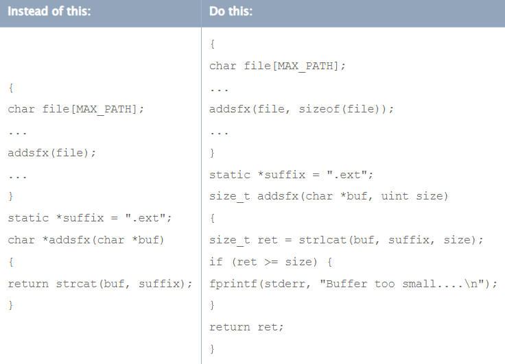
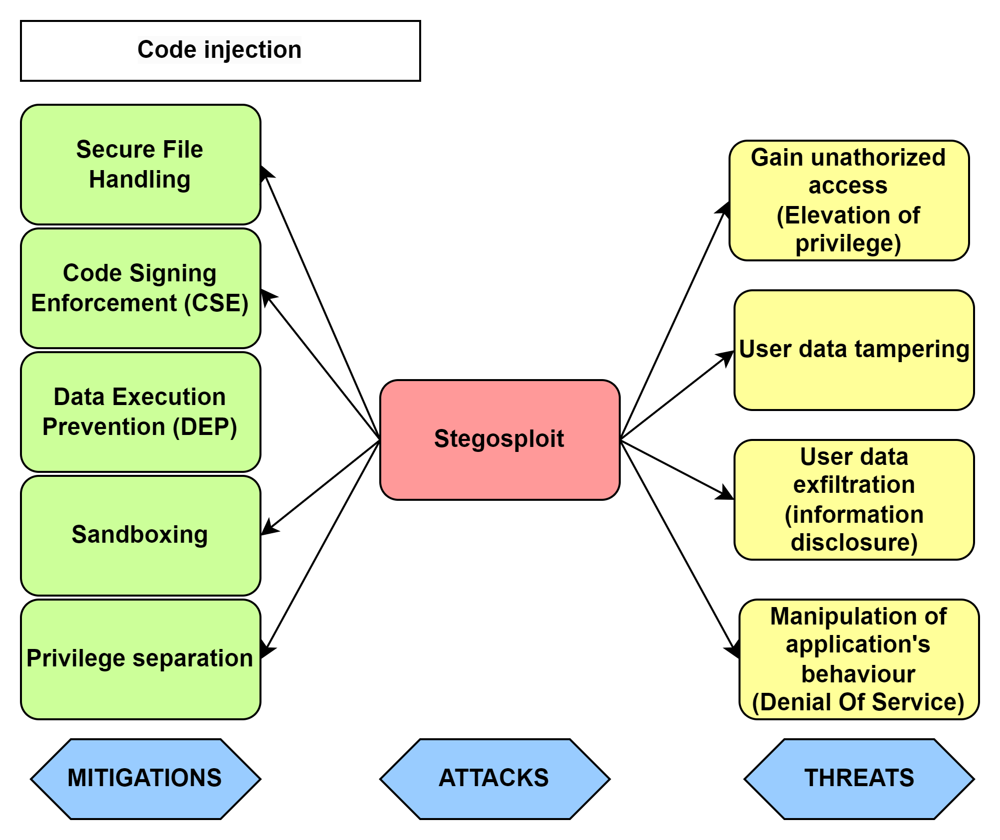

# Media input vulnerbilities

It is impmortant to keep in mind that obvious forms of input, such as strings entered through dialog boxes, are not the only potential source of malicious input. [[2]](#resources)

When a program solicits audio/photo/video input, it inherently exposes itself to the possibility of receiving unwanted data. This vulnerability arises from the dynamic nature of input sources, where the information provided may not always conform to the expected or desired format. Inappropriate data can take various forms, ranging from erroneous or malformed inputs to deliberately malicious content intended to exploit vulnerabilities within the program. 

Therefore developers must be vigilance in anticipating and managing diverse input scenarios to enhance the overall reliability and security of their applications.

## 1. Buffer overflow attack

When the input data is longer than will fit in the reserved space, if it is not truncated, that data will overwrite other data in memory. When this happens, it is called a buffer overflow.
Buffer overflows, both on the stack and on the heap, are a major source of security vulnerabilities in C, Objective-C, and C++ code. 
Although most programming languages check input against storage to prevent buffer overflows and underflows, C, Objective-C, and C++ do not.

If the overwritten memory contained data essential to the operation of the program, this overflow causes a bug that, being intermittent, might be very hard to find. If the overwritten data includes the address of other code to be executed and the user has done this deliberately, the user can point to malicious code that program can then execute.

Similarly, when the input data is or appears to be shorter than the reserved space (due to erroneous assumptions, incorrect length values, or copying raw data as a C string), this is called a buffer underflow. This can cause any number of problems from incorrect behavior to leaking data that is currently on the stack or heap.

For example, the input data might be longer than what you have reserved room for in memory.
Buffer overflows in one operating system's help system could be caused by maliciously prepared embedded images.
A commonly-used media player failed to validate a specific type of audio files, allowing an attacker to execute arbitrary code by causing a buffer overflow with a carefully crafted audio file. [[2]](#resources)

### Attack tree

Following photo shows terms that will further be described in this section. It represents 2 types of buffer oveflow attack (stack and heap overflow), identified threats that could be exploited, and proposed strategies and countermeasures to mitigate those attacks.

## 1.1. Stack overflow

In most operating systems, each application has a stack (and multithreaded applications have one stack per thread). This stack contains storage for locally scoped data.

The stack is divided into units called stack frames. Each stack frame contains all data specific to a particular call to a particular function. This data typically includes the function’s parameters, the complete set of local variables within that function, and linkage information—that is, the address of the function call itself, where execution continues when the function returns. Depending on compiler flags, it may also contain the address of the top of the next stack frame.

Each time a function is called, a new stack frame is added to the top of the stack. Each time a function returns, the top stack frame is removed. At any given point in execution, an application can only directly access the data in the topmost stack frame.

Following photo shows the schematic organization of the stack.

This becomes a serious problem when the application stores that data into a fixed-size buffer. If the user is malicious (or opens a file that contains data created by someone who is malicious), they might provide data that is longer than the size of the buffer. Because the function reserves only a limited amount of space on the stack for this data, the data overwrites other data on the stack.

As shown in next photo, an attacker can use this technique to overwrite the return address used by the function, substituting the address of other code. Then, when function C completes execution, rather than returning to function B, it jumps to the attacker’s code.

Because the application executes the attacker’s code, the attacker’s code inherits the user’s permissions. If the user is logged on as an administrator, the attacker can take complete control of the computer, reading data from the disk, sending emails, and so forth. (Note that apps subject to sandboxing, which includes any app in iOS, as well as any for which you adopt App Sandbox in macOS, are unable to take complete control of the device, although an attacker can still access the app’s own data this way.) [[2]](#resources)

## 1.2. Heap overflow

The heap is used for all dynamically allocated memory in your application. When you use malloc, the C++ new operator, or equivalent functions to allocate a block of memory or instantiate an object, the memory that backs those pointers is allocated on the heap.

Because the heap is used to store data but is not used to store the return address value of functions and methods, and because the data on the heap changes in a nonobvious way as a program runs, it is less obvious how an attacker can exploit a buffer overflow on the heap. To some extent, it is this nonobviousness that makes heap overflows an attractive target—programmers are less likely to worry about them and defend against them than they are for stack overflows.

In general, exploiting a buffer overflow on the heap is more challenging than exploiting an overflow on the stack. However, many successful exploits have involved heap overflows. There are two ways in which heap overflows are exploited: by modifying data and by modifying objects.

An attacker can exploit a buffer overflow on the heap by overwriting critical data, either to cause the program to crash or to change a value that can be exploited later (overwriting a stored user ID to gain additional access, for example). Modifying this data is known as a non-control-data attack. Much of the data on the heap is generated internally by the program rather than copied from user input; such data can be in relatively consistent locations in memory, depending on how and when the application allocates it.

An attacker can also exploit a buffer overflow on the heap by overwriting pointers. In many languages such as C++ and Objective-C, objects allocated on the heap contain tables of function and data pointers. By exploiting a buffer overflow to change such pointers, an attacker can potentially substitute different data or even replace the instance methods in a class object.[[2]](#resources)

Exploiting a buffer overflow on the heap might be a complex, arcane problem to solve, but some malicious hackers thrive on just such challenges. For example:

- A heap overflow in code for decoding a bitmap image allowed remote attackers to execute arbitrary code.
- A heap overflow vulnerability in a networking server allowed an attacker to execute arbitrary code by sending an HTTP POST request with a negative “Content-Length” header.
[1CVE-2006-0006 2CVE-2005-3655]

## Mitigations

- ***Input validation***

    As a general rule, it is always advisable to check all input received by program to make sure that the data is reasonable and appropriate for the purpose intended. This process is commonly known as input validation or sanity checking. 

    For example: 
    - Making sure that a filename is of legal length and contains no illegal characters
    - A graphics file can reasonably contain an image that is 200 by 300 pixels, but cannot reasonably contain an image that is 200 by -1 pixels. However, nothing prevents a file from claiming to contain such an image however.  [[2]](#resources)
    - Check for supported extension types
        <pre>
        NSArray *supportedExtensions = @"[ @"mov", @"mp4", ... ];
        NSURL *videoURL = ...;
        NSString *extension = [videoURL pathExtension];
        BOOL supported = [supportedExtensions indexOfObject:extension] != NSNotFound;
        if (supported) {...} else {...}</pre>

- ***App hardening***

    iOS provide a few features that can make it harder to exploit stack and buffer overflows, most important being address space layout randomization (ASLR) and a non-executable stack and heap. These features are briefly explained in the sections that follow.

    -  **Address Space Layout Randomization (ASLR)**

        Recent versions iOS, where possible, choose different locations for stack, heap, libraries, frameworks, and executable code each time software is run. This makes it much harder to successfully exploit buffer overflows because it is no longer possible to know where the buffer is in memory, nor is it possible to know where libraries and other code are located.

        Address space layout randomization requires some help from the compiler—specifically, it requires position-independent code.

        If compiling an executable on recent iOS target, the necessary flags are enabled by default. It is possible to disable this feature, if necessary, with the <code>-no_pie</code> flag, but for maximum security, it is recommended not to do so.[[2]](#resources)

    - **Non-Executable Stack and Heap**

        Recent processors support a feature called the *NX bit* that allows the operating system to mark certain parts of memory as non-executable. If the processor tries to execute code in any memory page marked as non-executable, the program in question crashes.

        iOS take advantage of this feature by marking the stack and heap as non-executable with <code>-allow_stack_execute</code> flag. This makes buffer overflow attacks harder because any attack that places executable code on the stack or heap and then tries to run that code will fail.
        [[2]](#resources)
    
    - **Compiler Flags**

        In order to make exploiting iOS applications harder for the attacker, it is also recommended to enable platform exploit mitigation compile-time options.
        In addition to *-pie* and *-allow_stack_execute*, the following flags have an effect on security:

        - <code>-fstack-protector</code> or <code>-fstack-protector-all—Enables</code> stack canaries 
            - Special values that, if modified, mean that the adjacent string overflowed its bounds and changes the order of items in the stack to minimize the risk of corruption. 
            - When functions call other functions that potentially could overflow, the compiler then inserts additional code afterwards to verify that the canary values have not been modified.

            - The *-fstack-protector* flag enables stack canaries only for functions that contain buffers over 8 bytes (a string on the stack, for example), and is enabled by default on recent OS.

            - The *-fstack-protector-all* flag enables stack canaries for all functions and therefore prevents potential stack smashing. To check if this option is enabled (should be on by default) here is the command to do so: 
            <code>otool -I -v binary | grep stack_chk_guard</code>[[3]](#resources) 

        - <code>-D_FORTIFY_SOURCE</code>
            - Adds additional static and dynamic bounds checking to a number of functions that normally provide none (sprintf, vsprintf, snprintf, vsnprintf, memcpy, mempcpy, memmove, memset, strcpy, stpcpy, strncpy, strcat and strncat). If set to level 1 (-D_FORTIFY_SOURCE=1), only compile-time checking is performed. Level 1 is enabled by default when compiling on recent OS. At level 2, additional run-time checking is performed.
        
         - <code>MallocCorruptionAbort</code>
            - An environment variable that tells 32-bit applications to abort if a malloc call would fail because of a corrupted heap structure. Aborting on heap corruption is automatically enabled for 64-bit applications.[[2]](#resources)

- ***Code reviews***

    Implementing good coding practises and verifying them through regular code reviews can go a long way when it comes to security. Here are some keypoints to go through when working with buffer sizes.

    - Avoid hard-coded buffer sizes

        When working with fixed-length buffers, you should always use *sizeof* to calculate the size of a buffer, and then make sure you don't put more data into the buffer than it can hold. Even if you originally assigned a static size to the buffer, either you or someone else maintaining your code in the future might change the buffer size but fail to change every case where the buffer is written to.

        The two snippets on the left side are safe as long as the original declaration of the buffer size is never changed. However, if the buffer size gets changed in a later version of the program without changing the test, then a buffer overflow will result.[[2]](#resources)

        

        The two snippets on the right side show safer versions of this code. In the first version, the buffer size is set using a constant that is set elsewhere, and the check uses the same constant. In the second version, the buffer is set to 1024 bytes, but the check calculates the actual size of the buffer. In either of these snippets, changing the original size of the buffer does not invalidate the check

    - Avoid unsafe concatenation

        Following photo shows code snippets of a function that adds an .ext suffix to a filename.

        

        Both versions use the maximum path length for a file as the buffer size. The unsafe version in the left column assumes that the filename does not exceed this limit, and appends the suffix without checking the length of the string. The safer version in the right column uses the strlcat function, which truncates the string if it exceeds the size of the buffer.[[2]](#resources)

- ***Fuzzing***

[https://developer.apple.com/library/archive/documentation/Security/Conceptual/SecureCodingGuide/Articles/ValidatingInput.html#//apple_ref/doc/uid/TP40007246-SW8]  

- ***Xcode's static analysis report***

    Static analysis can help to reveal memory leak, use-after-free, use-after-release, and other bugs. 
    The Xcode Clang Static Analyzer finds bugs in Objective-C, C, and C++ code. It finds hard-to-produce, edge-case bugs without the need to run code and shows the sequence of steps along which the bug occurs.
    Audit tip is to check the output of Xcode's "Build & Analyze" [[3]](#resources) 
    If the static analyzer doesn’t report any problems, don't assume there are none. The tool doesn’t detect all code flaws.

## 2. Code injection attack

Code Injection is the general term for attack types which consist of injecting malicious code that is then interpreted/executed by the application. This type of attack exploits handling of untrusted data. This type of attack can have severe consequences, allowing attackers to manipulate the behavior of the application, compromise user data, or gain unauthorized access. [[12]](#resources)

Processing a maliciously crafted media files can pose serious security risks, specially if there are vulnerabilities in the media processing software. When attacker craft media files with malformed or unexpected headers and metadata, processing libraries may misinterpret such data, leading to memory corruption or code execution. [[11]](#resources)

Embedding malicious scripts within media files that can be executed during processing also pose for code injection attack.
If the image processing software supports scripting, attackers may inject code that gets executed in the processing context.[[10]](#resources)

### Attack tree

Following photo shows terms that will further be described in this section. It shows an example of code injection attack called stegosploit, identified threats that could be exploited through attack, and proposed strategies and countermeasures to mitigate those attacks.

## 2.1. Stegosploit

*Steganography* can be defined as the process of hiding a secret small multimedia data inside another but much larger multimedia data such as image, text, file or video. The secret information is hidden in a way that it's not visible to the human eyes. Deep learning technology, which has emerged as a powerful tool in various applications including image steganography, has received increased attention recently. The main concern of steganography is to conceal the existence of communication and protection of secret data.[[16]](#resources)

*Steganalysis* is used to detect the presence of any secret message covered in the image and to extract the hidden data. Steganalysis helps in classifying if the image is either a stego image or a normal image. [[16]](#resources)

*Stegosploit* is a term combining steganography and exploit technology that was recently developed.[[17]](#resources)

### Steganography techniques

Steganography does not exclusevly implies image manipulation. Here is a tree of possible multimedia embedment processes and techinuques for achiving it. While inherently not malicious techniques, with malicious intentions these are potential ways an attacker could integrate their code.

 
There are various techniques for image steganography. In all cases, the principle remains the same: hide in plain sight by piggybacking an invisible message on a visible carrier. Here is an explanation of one of the Traditional-based steganography methods called *Least Significant Bit technique* 

#### **LSB - Least Significant Bit technique**

Conventionally, Least Significant Bits (LSB) substitution method is employed to perform image steganography. Images are usually of higher pixel quality, out of which not all the pixels are used. LSB methods works under the assumption that modifying a few pixel values would not show any visible changes.[[16]](#resources)

The LSB methods are used in hiding the secret information inside videos also. Videos are sequences of images called the video frames. Each video is dissected into image frames and the binary bits of the secret information is hidden in the LSB of the image frames of the video. A basic form of LSB substitution method and a combination of the huffman encoding and LSB substitution  ethods is used on videos. [[16]](#resources)

Example:

Suppose we have three bytes representing one particular color, in this case orange (1). The least significant bits – the last four if we’re reading left-to-right – do not make much of an impact on the color’s visual appearance. We can change those to anything we like and the pixel will still look pretty much the same. So, let’s take a completely different color - turquoise (2). And replace the last 4 bits in the code for orange with the first four bits of the code for turquoise, to produce this composite RGB (3). There’s no discernible impact on the appearance of the color this generates.[[18]](#resources)

    (1)  
    (2) 
    (3)  

Two pixels for the price of one, since there’s no increase in the file size. We can transmit our hidden message without increasing the bandwidth of the original message and without manipulating the file format, so there’s nothing for simple detection methods that rely on file scanning to find. Indeed, the code is completely obfuscated until it is reassembled by the attacker.[[18]](#resources)

In short, this means an attacker can use the last four bits of encoded RGB data to write other data without significantly degrading the visual presentation of the image or inflating the file size. The hidden data can then be read-off by another program and used to reconstruct a malicious file or to exfiltrate user data.[[18]](#resources)

 

### Types of hidden malicious code in image file

The following short analysis of types of hidden malicious code is aimed at identifying the area in which malicious code is inserted in the image file structure. A normal image file is configured with three areas: header information, additional information, and actual image data. [[17]](#resources)

The structures of image files containing malicious code are shown here.

- (a) - In the first type, the image format is normally configured, although the malicious code is added at the end of the image data in the form of a binary, including the PE, *Dynamic Linking Library* (DLL), and *Executable and Linkable Format* (ELF) formats; furthermore, this type is commonly employed to insert malicious script. This approach exploits the fact that image viewer applications process only the end of the image (EOI) and ignore the malicious binary code. If the malicious binary code is a *Drive by Download* (DBD) type, it can be disguised as an image data at the time of download and flow into the main memory.[[17]](#resources)

- (b) The second type presents only the file identification signature for each image type, and the remaining area contains a malicious script written in JavaScript, HTML, and PHP, among other forms. Because this exploits the fact that several applications judge *Multipurpose Internet mail extension* (MIME) types by using only the header information of the file, these malicious codes are neither detected nor blocked in the case of image files that permit the introduction of MIME types.[[17]](#resources)

- (c) The third type inserts a malicious script into the additional information area of the image file format; moreover, it can also hide the malicious code in the area containing the image data (the actual image pixel information). The use of various encryption methods and obfuscation algorithms to hide the malicious code or the use of steganography algorithms in the malicious script poses a highly difficult challenge. It is extremely difficult to detect and analyze malicious codes when hidden in the pixel information within the image data areas exploited by various steganography algorithms or tools.[[17]](#resources)

 

### Steghide - simple tool for steganography

Steghide is a steganography program that is able to hide data in various kinds of image and audio-files. The color-respectivly sample-frequencies are not changed thus making the embedding resistant against first-order statistical tests.[[19]](#resources)

Command to create a new image that contains the text file we want to hide. The stego file is slightly bigger than the original because it contains additional information.

    steghide embed -ef <data> -cf <image> -sf <stego_image> -v

Let’s take a look at the command:
- steghide – We specify the tool to use
- embed – Tells the tool we want to embed data
- -ef – Embed file, specifies the file to hide
- -cf – Cover file, specifies the cover image
- -sf – Stego file, creates a duplicate of the original image with the embedded file in it
- -v – Verbose, gives us more information about the process [[20]](#resources)

We can extract the data from the stego file using the command below.

    steghide extract -sf <stego_image> -xf <extracted_data>

Let’s review the command above:

- -sf – stego file, the image containing hidden data
- -xf – extract file, the file with extracted data [[20]](#resources)

 

### Mitigations 

- ***Code Signing Enforcement (CSE)***

    In order to prevent the introduction of new executable code at runtime, iOS implements a security protection called *Code Signing Enforcement* (CSE). This prevents applications from loading unsigned libraries, downloading new code at runtime, and using self-modifying code. It is also a strong protection against remote attacks that inject new native code into the application [[5]](#resources)

    One of the most important security mechanisms in iOS is code signing. All binaries and libraries must be signed by a trusted uthority (such as Apple) before the kernel will allow them to be executed. Furthermore, only pages in memory that come from signed sources will be executed. This means apps cannot change their behavior dynamically or upgrade themselves. Together, these actions prevent users from downloading and executing random files from the Internet. All apps must come from the Apple App Store (unless the device is configured to accept other sources). Apple has the ultimate approval and inspects applications before they can be hosted at the App Store. In this way, Apple plays the role of an antivirus for iOS devices. It inspects each app and determines if it is okay to run on iOS devices. This protection makes it very hard to get infected with malware. In fact, only a few instances of malware have ever been found for iOS. 
    
    The other impact of code signing is that it complicates exploitation. Once an exploit is executing code in memory, it might want to download, install, and execute additional malicious applications. This will be denied because anything it tries to install will not be signed. Therefore, exploits will be restricted to the process they originally exploit, unless it goes on to attack other features of the device. 
    
    This code signing protection is, of course, the reason people jailbreak their phones. Once jailbroken, unsigned applications can be executed on the device. Jailbreaking also turns off other features (more on that later).  [[14]](#resources)

- ***Data Execution Prevention (DEP)***

    Normally, data execution prevention (DEP) is a mechanism whereas a processor can distinguish which portions of memory are executable code and which portions are data; DEP will not allow the execution of data, only code. This is important because when an exploit is trying to run a payload, it would like to inject the payload into the process and execute it. DEP makes this impossible because the payload is recognized as data and not code. The way attackers normally try to bypass DEP is to use return-oriented programming (ROP), which is discussed in Chapter 8. ROP is a procedure in which the attacker reuses existing valid code snippets, typically in a way never intended by the process, to carry out the desired actions. 

    The code-signing mechanism in iOS acts like DEP but is even stronger. Typical attacks against DEP-enabled systems use ROP briefly to create a section of memory that is writable and executable (and hence where DEP is not enforced). Then they can write their payload there and execute it. However, code signing requires that no page may be executed unless it originates from code signed by a trusted authority. Therefore, when performing ROP in iOS, it is not possible to turn off DEP like an attacker normally would. Combined with the fact that the exploit cannot execute applications that they may have written to disk, this means that exploits must only perform ROP. They may not execute any other kinds of payloads such as shellcode or other binaries. Writing large payloads in ROP is very time-consuming and complex. This makes exploitation of iOS more difficult than just about any other platform.  [[14]](#resources)

- ***Sandboxing***

    iOS enforces restrictions that limit each application's access to user data and the operating system APIs. This mechanism is designed to protect against incursions by malicious third-party applications, and to limit the damage caused by exploitation of a non-malicious application. To implement this, iOS runs each application in a *sandbox* that restricts its access to the device file system and memory space.[[5]](#resources)

    The final piece of the iOS defense is sandboxing. Sandboxing allows even finergrained control over the actions that processes can  perform than the UNIX permission system mentioned earlier. For example, both the SMS application and the web browser run as user mobile, but perform very different actions. The SMS application probably doesn't need access to your web browser cookies and the web browser doesn't need access to your text messages. Third-party apps from the App Store shouldn't have access to either of these things. Sandboxing solves this problem by allowing Apple to specify exactly what permissions are necessary for apps. (See Chapter 5 for more details.) Sandboxing has two effects. First, it limits the damage malware can do to the device. If you imagine a piece of malware being able to get through the App Store review process and being downloaded and executed on a device, the app will still be limited by the sandbox rules. It may be able to steal all your photos and your address book, but it won't be able to send text messages or make phone calls, which might directly cost you money. Sandboxing also makes exploitation harder. If an attacker finds a vulnerability in the reduced attack surface, manages to get code executing despite the ASLR and DEP, and writes a productive payload entirely in ROP, the payload will still be confined to what is accessible within the sandbox. Together, all of these protections make malware and exploitation difficult, although not impossible. [[14]](#resources)

- ***Secure File Handling***

    Always validate and sanitize user input on the server to ensure that malicious data doesn't reach the application. [[2]](#resources) Implement strict file handling mechanisms and ensure that you validate the file type and content.

    When dealing with media inputs, use safe APIs provided by iOS for handling media files to avoid any vulnerabilities. Avoid using unsafe functions or methods that may expose your app to injection attacks. [[8]](#resources)

- **Least privilege**

    // EXPAND THIS PART!!

    For this reason, even if you are confident that your code is free of buffer overflow problems, you should limit exposure by running with the least privileges possible.

- ***Code review***

    For applications distributed via its AppStore (which is the only software installation method allowed on a device with default settings) Apple additionally performs automated and manual code review of third-party applications.
    Despite these protections, malicious or privacy-violating applications have passed review. [[6]](#resources)

## 3. Malware attack

This malware might be bundled with software the user wants, or it might disguise itself as something the user wants. In either case, the user downloads and installs the malware and when the malware is executed, it performs its malicious actions. These actions might include sending e-mails, allowing remote access to an attacker, installing a keylogger, and so on. [[14]](#resources)

Apple iOS has a major advantage over Android in terms of security due to the closed nature of the Apple store whereby all apps are vetted by Apple before release. This helps to reduce the number of malware apps found in the store. [[15]](#resources)

Common malware known to speciffically attack media layer is AdKing or AdLord adware. 

This is a form of malware which can only infect *jailbroken* devices. It uses third-party Cydia library to display advertisements over other apps or in the notification bar and ask users to download the promoted iOS apps. The malware will be functioning whenever the apps are open. The iOS framework involved is the *AVFoundation* framework, located at the Media layer.[[7]](#resources)

### Jailbrake 

### Mitigations

- [***Sandboxing***](#mitigations-1)

- ***Jailbreak detection***

    "Jailbreaking" has been used to permit unsigned iOS code to be executed on an Apple mobile device and to permit service connections to other mobile carriers. Cydia, an unauthorized iOS application installer, has been distributing unapproved applications in competition to the Apple app store. While unsigned code may not be malicious, Apple's signing process does provide some assurance that classic C vulnerabilities have been addressed. [[13]](#resources)

    Application logic and behavior might be compromised on JailBroken devices, and application exposed to attacks. With that said, any hacker can bypass those basic checks with some effort, therefore it is important to know this and not completely rely on the jailbreak detection methods.

    The following tests check and inform the developer that if device is jailbroken:

    - A lot of unique files and applications are installed on a jailbroken device. Checking for these files in the file system can help identify whether the device is jailbroken or not. This test checks that the developer is looking for these files.
    - Check to see whether the application follows sandboxing rules can help the user identify whether the application is jailbroken or not. A good way to check is to see if we can modify a file in some location outside the application bundle. This test looks for such checks by the developer.
    - If calling the Cydia's URL scheme (Cydia://) from your application results in success, it can be sure that the device is jailbroken. This test checks whether the developer performs this check.

    Apart from these, it is advisable to check every possible way to really find if the device is compromised. [[1]](#resources)

- ***Third party library mitigations***
    
    Third-party frameworks are necessary evils. They offer some valuable resources that enhance your iOS app functionalities but most of them are vulnerable and loosely secured. One of the iOS app development best practices is to keep these third-party integrations updated to the latest stable version available at all times. Keep an eye out for ad libraries if you're using any. Don't disable ATS  (Application Tracking System) even if the integration persuades you to do so.[[8]](#resources)

    Carefully vet third-party libraries and SDKs used in your app to ensure they come from reputable sources with regular updates and security patches. Regularly update these libraries to benefit from the latest security enhancements.[[9]](#resources)

## Resources
1. [iOS Mobile App Security — Part I: Best practices for iOS mobile developers](https://medium.com/@kavithakumarasamy89/ios-mobile-app-security-part-i-best-practices-for-ios-mobile-developers-1220748b1f3)
2. [Secure Coding Guide - Avoiding Buffer Overflows and Underflows](https://developer.apple.com/library/archive/documentation/Security/Conceptual/SecureCodingGuide/Articles/BufferOverflows.html#//apple_ref/doc/uid/TP40002577-SW1)
3. [Secure iOS application development](https://github.com/felixgr/secure-ios-app-dev)
4. [Secure Coding Guide - Types of Security Vulnerabilities](https://developer.apple.com/library/archive/documentation/Security/Conceptual/SecureCodingGuide/Articles/TypesSecVuln.html#//apple_ref/doc/uid/TP40002529-SW14)
5. [Data Security on Mobile Devices: Current State of the Art, Open Problems, and Proposed Solutions](https://arxiv.org/pdf/2105.12613.pdf)
6. [App store - Code review](https://developer.apple.com/app-store/review/)
7. [iOS mobile malware analysis: a state-of-the-art](https://oarep.usim.edu.my/jspui/bitstream/123456789/20391/1/iOS%20mobile%20malware%20analysis%20a%20state-of-the-art.pdf)
8. [iOS App Development Best Practices](https://aglowiditsolutions.com/blog/ios-app-development-best-practices/)
9. [Building a Secure iOS App: Best Practices and Tips](https://medium.com/tech-and-tricks/building-a-secure-ios-app-best-practices-and-tips-c3841ed3d12d)
10. [Multiple Vulnerabilities in Apple Products Could Allow for Arbitrary Code Execution](https://www.cisecurity.org/advisory/multiple-vulnerabilities-in-apple-products-could-allow-for-arbitrary-code-execution_2023-052)
11. [CVE-2023-32384](https://www.tenable.com/cve/CVE-2023-32384)
12. [Owasp code injection](https://owasp.org/www-community/attacks/Code_Injection)
13. [COMPARATIVE ANALYSIS OF MOBILE APPLICATION DEVELOPMENT AND SECURITY MODELS](https://iacis.org/iis/2011/301-312_AL2011_1694.pdf)
14. [iOS Hacker's handbook](./resource/ios-hackers-handbook.pdf)
15. [Security in Mobile Computing: Attack Vectors, Solutions, and Challenges](https://sci-hub.se/https://doi.org/10.1007/978-3-319-52712-3_13)
16. [Image Steganography: A Review of the Recent Advances](https://sci-hub.se/10.1109/ACCESS.2021.3053998)
17. [ImageDetox: Method for the Neutralization of Malicious Code Hidden in Image Files](https://www.mdpi.com/2073-8994/12/10/1621)
18. [Hiding Code Inside Images](https://www.sentinelone.com/blog/hiding-code-inside-images-malware-steganography/)
19. [Steghide](https://steghide.sourceforge.net/)
20. [What is Steganography? How to Hide Data Inside Data](https://www.freecodecamp.org/news/what-is-steganography-hide-data-inside-data/)