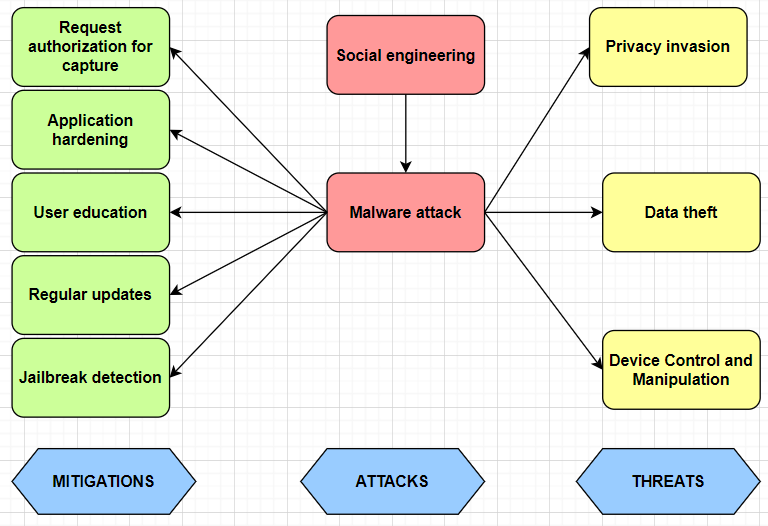

# Unauthorized access to microphone/camera

Unauthorized access to the microphone or camera on iOS phones refers to an application or process gaining access to the device's microphone or camera without the explicit consent of the user. Apple places a strong emphasis on user privacy and security, and it has implemented various measures to protect users from unauthorized access to sensitive components like the microphone and camera.

### Threats

- ***Privacy Invasion***

    Intruders can spy on individuals in their private spaces, capturing audio and video without the person's knowledge or consent. This can lead to the exposure of sensitive information where secured details will be compromised if screenshot or screen recording is performed. [[3]](#resources)

- ***Data Theft*** 

    An attacker could record login/any sensitive screen and capture username and password entered.
    In video streaming like an app, any paid video content can be streamed and recorded. [[3]](#resources)

    Attackers may gain access to confidential conversations or information captured by the microphone or camera, leading to potential identity theft, financial fraud, or other forms of data exploitation.

- ***Device Control and Manipulation***

    Unauthorized access may allow attackers to take control of a device's camera or microphone to manipulate information or create false narratives.

### Attacks

- ***Social engineering***

    Phones have the capability to tape any sort of ambient sound through built-in microphones, including private conversations, and to transmit sensitive data, such as the recording itself or information extracted from recorded speech, to remote servers over the Internet. Mobile apps installed on a phone could exploit these capabilities for secret eavesdropping. [[5]](#resources)

    Before an app can access microphones in iOS devices, permission has to be granted by the user. However, people tend to accept such requests blindly if they are interested in an app’s functionality. [[5]](#resources). 
    
    The system remembers the user’s response to each access alert, so subsequent uses of the corresponding capture device don’t cause the alert to appear again.[[1]](#resources)

    Once a permission is granted, it is usually not transparent for users when and for which particular purpose data is being collected and to which servers it is being sent.

- ***Malware Attacks***

    First, malware for iOS is installed on the victim's device. The attack vectors might vary from case to case and include social engineering, spear-phishing, exploits, and other malicious techniques.

    A Trojan attempts to surreptitiously jailbreak an iPhone, and then the mobile spying module is installed. 
    Trojans are strong enough to carry out every type of surveillance you might anticipate from malware of this type, like location tracking, photo-taking, WhatsApp, SMS, and other messenger snooping, contact-stealing, and so forth.

    Some restrictions might or might not allow hackers to exploit a particular iPhone. It must first run an iOS version that can be "jailbroken".[[6]](#resources)

### Mitigations

- ***Request authorization for capture***

    Always test the AVCaptureDevice authorizationStatus(for:) method before setting up a capture session. If the user hasn’t granted or denied capture permission, the authorization status is AVAuthorizationStatus.notDetermined. In this case, use the requestAccess(for:completionHandler:) method to tell the system to prompt the user.

    Call requestAccess(for:completionHandler:) before starting capture, but only at a time that’s appropriate for your app. For example, if photo or video capture isn’t the main focus of your app, check for permission only when the user invokes your app’s camera-related features. [[1]](#resources)

- ***Application hardening***

    The Restrictions Payload is designated by specifying *com.apple.applicationaccess* as the *PayloadType* value. A Restrictions payload allows the developer to restrict the user from doing certain things with the device, such as using the camera.
    In addition to the settings common to all payloads, this payload defines the following intrest key:
    
    *allowScreenShot* of type Boolean - optional but recommended (Defaults to true) 
    If set to false, users can't save a screenshot of the display and are prevented from capturing a screenrecording.
    it also prevents other apps from observing remote screens. [[2]](#resources)
    
- ***User education***

    The system requires that an app provides static messages to display to the user when the system asks for permission to access the camera or microphone. 

    To configure access alerts:
    - If an app uses device cameras, include the *NSCameraUsageDescription* key in your app's *Info.plist* file.
    - If an app uses device microphones, include the *NSMicrophoneUsageDescription* key in your app's *Info.plist* file.

    For each key, provide a message that explains to the user why your app needs to capture media so the user can feel confident granting permission to your app. [[1]](#resources)

    By educating users through clear and well-designed user interfaces that give users relevant information, they are able to make informed decisions.

- ***Regular updates***

    Regularly updating iOS on device to the most recent version can reduce infection threats.

- [***Jailbreaking detection***](media-input-vulnerbilities.md/#mitigations-2)

    Some restrictions might or might not allow hackers to exploit a particular iPhone. It must first run an iOS version that can be jailbroken. For instance, the latest ones have no recorded jailbreak, but older versions are weak. Secondly, an iPhone has its passcode removed before being jailbroken. Though both scenarios are common, spyware developers have an extensive collection of iOS-running awards.

## Resources
1. [Requesting authorization to capture and save media](https://developer.apple.com/documentation/avfoundation/capture_setup/requesting_authorization_to_capture_and_save_media#2962313)
2. [Configuration Profile Reference](https://developer.apple.com/business/documentation/Configuration-Profile-Reference.pdf)
3. [iOS Mobile App Security — Part I: Best practices for iOS mobile developers](https://medium.com/@kavithakumarasamy89/ios-mobile-app-security-part-i-best-practices-for-ios-mobile-developers-1220748b1f3)
4. [Security Threats to Mobile Multimedia Applications: Camera-Based Attacks on Mobile Phones](https://sci-hub.se/10.1109/MCOM.2014.6766089)
5. [Is My Phone Listening in? On the Feasibility and Detectability of Mobile Eavesdropping](https://link.springer.com/chapter/10.1007/978-3-030-22479-0_6)
6. [How iOS Malware Can Silently Spy on Users?](https://www.efani.com/blog/ios-malware-silently-spies-on-users)