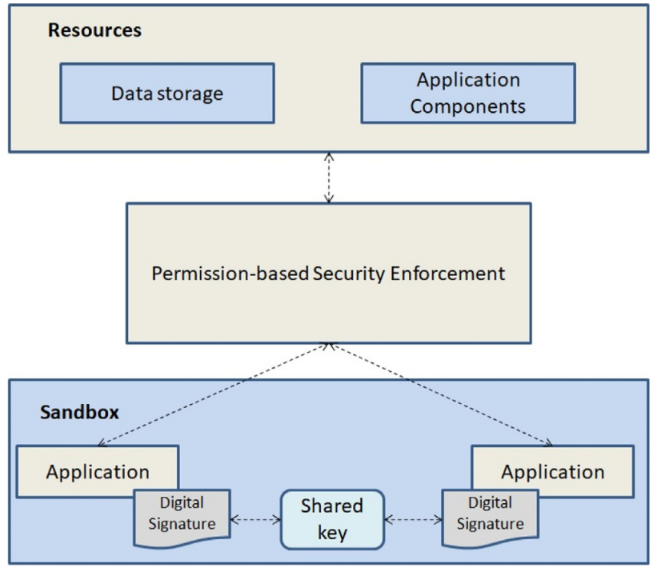
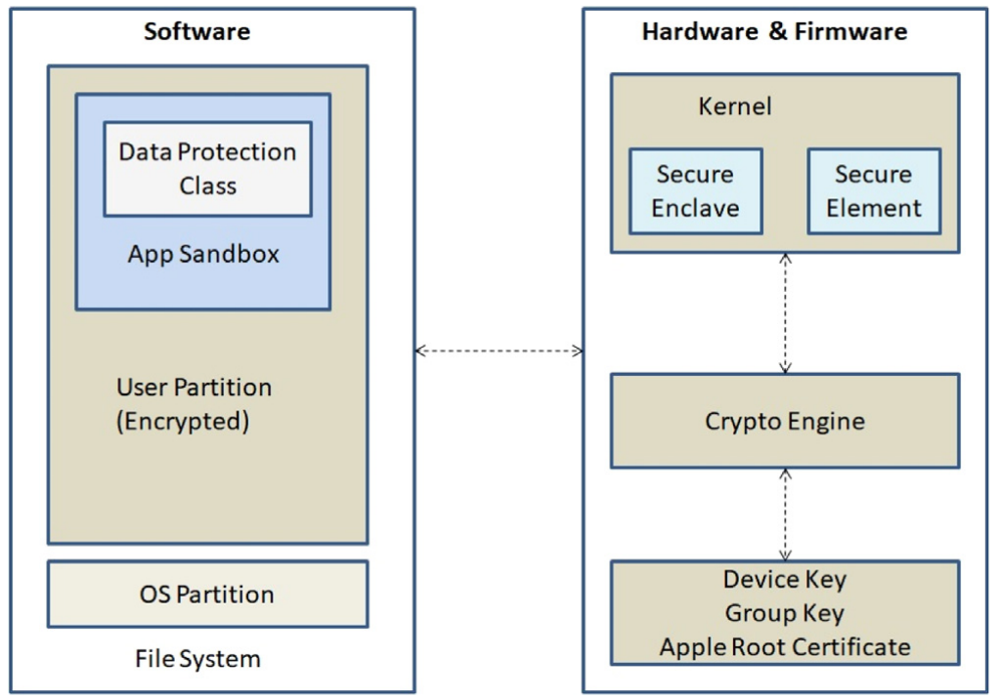

# Mitigations

## Andorid security model
  

## iOS ssecurity model

## 1. Isolation mechanism (app sandboxing)
Sandbox environment is provided for each and every application executing in the device. In this way they cannot modify other application.

### Android
 * applications are separated from each other and from the system's kernel
 * isolation from kernel prevents gaining access to the administrative control
 * however, permissions are given to the applications to access the system resources

### iOS
 * Similar to Android, iOS enforces app isolation by running each app in its own sandboxed environment
 * iOS uses a more restrictive permission model, and restricts direct access to the file system
 * This makes the iOS systems more secured as compared to Android

## 2. Data encryption
### Android
 * Previous versions of Android provide Full Disk Encryption (FDE). 
 * Recent Android versions support hardware encryption,
    - Trusted Execution Environment (TEE) 
    - Filebased Encryption (FBE) - different files are encrypted with different keys so that they can be unlocked independently
### iOS
 * Combinations of hardware and software keys are iterated to encrypt every file to ensure only offline brute-force attack can carry out
 * Data protection class is associated with every file, which allows developers to define under what circumstances the data is accessible.

## 3. App permissions
Permissions control and regulate the access to device resources, once an app is downloaded on the device. In most of the
cases users are not aware about the permissions which applications are accessing, thereby causing serious security concerns.
### Android
 * Shown to the users while installing the app.
 * The permission system in Android is not very effective since security decisions are handled by the device users.
### iOS
 * permissions that an app needs to access are not shown to the users.
 * has isolation policy which grants the permissions

## 4. Auto erase mechanism (Remote wipe)
Personal and sensitive information can be wiped off from the smartphone using auto erase feature.

### Android
 * native apps do not provide auto erase mechanism
 * however third-party applications can be used for auto erase.
### iOS
 * if an attacker tries to attempt failed passcode attempts ten times, all the data on the device is automatically erased using 
this feature.

## 6. APP store security
*Application provenance* - process in which third-party applications are analyzed for their intended functionality and security.
### Android
 * Google play store + third party app markets 
 * 
### iOS
 * Official App store

## Device encryption
## Screen locks

## Two factor authentification
## Biometric authentification

## Secure data storage

## VPN
## Mobile Device Management (MDM)
## Antivirus/AntiMalware

## OS updates
## Secure boot